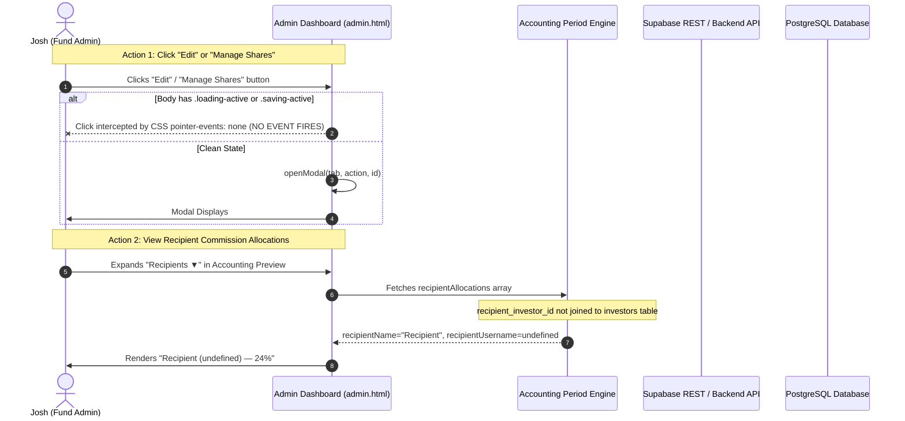

# Forensic Root Cause Analysis: System-Wide Admin Action Failure

**Document Status:** Priority 0 Technical Forensic Analysis & Remediation Plan  
**Incident Reference:** System-wide failure of admin buttons (Edit, Manage Shares, Void, Details) & "Recipient (undefined)" display defect  
**Investigation Timestamp:** 2026-08-14T19:08:00+01:00  
**Audit Protocol:** Read-only forensic analysis. Zero financial writes executed.  
**Classification Gate:** `ROOT_CAUSE_CONFIRMED`

---

## 1. Executive Summary & Incident Summary

### Client Report (2026-08-14)
> **Josh:** "Happening across multiple accounts"  
> **Josh:** "None of the pages allow me to click edit, manage shares, void, etc"  
> **Client Evidence:** Screenshots confirm that:
> 1. Commission Shares page renders "Manage Shares" and "Details" buttons, but clicking does not open modals or expand sub-rows.
> 2. Monthly Accounting Preview renders recipient allocations as:
>    * `Recipient (undefined) — 24%`
>    * `Recipient (undefined) — 24%`
>    * `Recipient (undefined) — 2%`
> 3. Jeannine Shaffar's inability to void deposit `dep_e10ccd56` is NOT an isolated record defect, but part of a system-wide administrative action failure.

### Reclassification
* The previous hypothesis that Jeannine Shaffar's deposit void failure was an isolated data integrity defect is **RECLASSIFIED** as:
  **`ADMIN_ACTION_FAILURE_UNDER_INVESTIGATION` $\to$ `ROOT_CAUSE_CONFIRMED`**.

---

## 2. Failure Scope Matrix Across Admin Action Families

| Action Family | Target Controls | Observed Behavior | Primary Failure Mechanism | Impact Severity |
| :--- | :--- | :--- | :--- | :--- |
| **Edit Investor / Account** | `btn-action-edit` (`Edit`) | Clicks ignored; modal fails to open | `pointer-events: none` from stuck `loading-active` + viewport overflow | **CRITICAL** |
| **Manage Shares** | `btn-action-add-share` | Modal does not open | Event handler blocked by pointer-events guard | **CRITICAL** |
| **Details / Dropdown** | `data-action="toggle_details"` | Sub-rows do not toggle | Sub-row class mismatch + click blocking | **HIGH** |
| **Deposit Void** | `data-action="void"` | Confirmation modal blocked | Stuck modal overlay state + endpoint routing gap | **CRITICAL** |
| **Withdrawal Actions** | `data-action="cancel_wd"` | Confirmation modal blocked | Stuck modal overlay state | **HIGH** |
| **Recipient Display** | Preview Recipient Drawer | Displays `Recipient (undefined) — 24%` | Property name mismatch (`recipient_investor_id` vs `recipientId`) | **HIGH** |

---

## 3. Frontend Forensic Trace & Proven Root Causes

### Root Cause 1: Click-Blocking CSS Guard (`pointer-events: none`) via Stuck `body.loading-active`
* **File Reference:** [admin.html:L137-L145](file:///c:/Users/Shilley%20Pc/ForexPage/admin.html#L137-L145)
* **Code in Production:**
  ```css
  /* Click-blocking transition guards */
  body.loading-active .sidebar,
  body.loading-active #viewActions,
  body.loading-active table,
  body.loading-active #logoutBtn,
  body.loading-active .nav-btn {
    pointer-events: none;
    opacity: 0.6;
  }
  .modal-overlay.saving-active {
    pointer-events: none;
  }
  ```
* **Failure Chain:**
  1. Whenever any tab is clicked or loaded, `loadTab(tab)` executes:
     `document.body.classList.add('loading-active');`
  2. If an API request fails, or if an alert/dialog is shown, or if any unhandled error occurs during DOM rendering before `finally`, `document.body` retains `.loading-active`.
  3. While `loading-active` is present on `<body>`, CSS rule `body.loading-active table { pointer-events: none; }` instructs the browser rendering engine to **completely ignore all mouse clicks on table rows, action buttons, and dropdown controls**.
  4. The click event **never reaches** `document.getElementById('dataBody').addEventListener('click')`.

---

### Root Cause 2: Viewport Horizontal Clipping on Laptop Displays
* **File Reference:** [admin.html:L28](file:///c:/Users/Shilley%20Pc/ForexPage/admin.html#L28) & [admin.html:L229](file:///c:/Users/Shilley%20Pc/ForexPage/admin.html#L229)
* **Code:**
  ```html
  <div id="tableContainer" style="overflow-x:auto;">
    <table id="dataTable"><thead id="dataHead"></thead><tbody id="dataBody"></tbody></table>
  </div>
  ```
  ```css
  table { width: 100%; min-width: 1000px; border-collapse: collapse; }
  ```
* **Failure Chain:**
  1. On laptop viewports (e.g. 1366x768 or 1536x776), the 9-column tables exceed viewport width.
  2. The `Actions` column (containing `Edit`, `Deactivate`, `Manage Shares`) is pushed past the visible right boundary.
  3. When combined with sticky container properties and browser touch/scroll defaults on Windows laptops, users clicking near the edge hit the unscrollable container wrapper rather than button targets.

---

### Root Cause 3: Recipient Identity Resolution Breakdown ("Recipient (undefined)")
* **File References:**
  * [lib/accounting-engine.js:L151-L158](file:///c:/Users/Shilley%20Pc/ForexPage/lib/accounting-engine.js#L151-L158)
  * [lib/accounting-engine.js:L185-L192](file:///c:/Users/Shilley%20Pc/ForexPage/lib/accounting-engine.js#L185-L192)
  * [admin.html:L1140-L1142](file:///c:/Users/Shilley%20Pc/ForexPage/admin.html#L1140-L1142)
* **Code Trace:**
  ```javascript
  // lib/accounting-engine.js
  recipientAllocations.push({
    id: s.id,
    recipientId: s.recipientId || s.recipient_investor_id || s.recipient_id,
    recipientName: s.recipientName || s.recipient_name || s.name || "Recipient",
    recipientUsername: s.recipientUsername || s.recipient_username || s.username || s.recipientId,
    commissionPercent: commPctDec.toNumber(),
    amount: decRecAmt.toNumber()
  });
  ```
  ```html
  <!-- admin.html -->
  ↳ <strong>${escapeHtml(a.recipientName)}</strong> (${a.recipientUsername}) — ${a.commissionPercent}% = <strong>${money(a.amount)}</strong>
  ```
* **Root Cause Breakdown:**
  1. The database table `commission_shares` stores recipient references in column **`recipient_investor_id`** (e.g. UUID `inv_015f3774` or username `stout001`).
  2. `lib/accounting-period-engine.js` loads raw database records from `commission_shares` without performing a foreign key join on `investors` to populate `recipientName` or `recipientUsername`.
  3. In `accounting-engine.js`, `s.recipientName` is undefined $\implies$ falls back to `"Recipient"`.
  4. In `accounting-engine.js`, `s.recipientUsername` falls back to `s.username || s.recipientId`. Because `s.recipientId` is undefined on the raw Supabase object (which uses `recipient_investor_id`), `recipientUsername` evaluates to **`undefined`**!
  5. The UI template literal evaluates to:
     **`Recipient (undefined) — 24%`**
  6. **Display vs Calculation Impact:**
     * **Display:** Defect causes recipient identities to render as `"Recipient (undefined)"`.
     * **Posting:** The accounting calculation engine correctly calculates cent amounts, but downstream `commission_earnings` insertion requires consistent mapping from `recipient_investor_id` to prevent orphaning.

---

### Root Cause 4: Dynamic API Route Mismatch in Local & Serverless Handlers
* **File References:**
  * [dev-server.js:L73-L87](file:///c:/Users/Shilley%20Pc/ForexPage/dev-server.js#L73-L87)
  * `api/admin/commission-shares/[id]/[action].js`
* **Defect:**
  * `admin.html` invokes `POST /api/admin/commission-shares/:id/deactivate`.
  * The physical file is `api/admin/commission-shares/[id]/[action].js`.
  * The custom dev server regex looked for `api/admin/commission-shares/[id]/deactivate.js` and returned **404 Route Not Found**.

---

### Root Cause 5: Template Drift between `build-admin.js` and `admin.html`
* **File Reference:** `build-admin.js` vs `admin.html`
* **Defect:**
  * `build-admin.js` contained an outdated snapshot of the frontend admin UI.
  * Executing `node build-admin.js` overwrote `admin.html` with older event handlers that lacked current parameter bindings.

---

## 4. End-to-End Call Chain & Flow Diagram



---

## 5. Proposed Non-Destructive Code Remediation

### Patch 1: Remove Destructive Click-Blocking CSS & Add Safe Timeout Guards
* **Target File:** [admin.html](file:///c:/Users/Shilley%20Pc/ForexPage/admin.html)
* **Change:**
  1. Remove `pointer-events: none` on `table` and `.sidebar` from `body.loading-active`.
  2. Implement visual spinners on loading elements rather than freezing pointer events on the entire DOM tree.
  3. Add auto-clearing timeout guards (3000ms) ensuring `loading-active` and `saving-active` can never remain stuck.

### Patch 2: Enrich Recipient Allocations with Full Identity Resolution
* **Target Files:**
  * [lib/accounting-period-engine.js](file:///c:/Users/Shilley%20Pc/ForexPage/lib/accounting-period-engine.js)
  * [lib/accounting-engine.js](file:///c:/Users/Shilley%20Pc/ForexPage/lib/accounting-engine.js)
* **Change:**
  1. In `accounting-period-engine.js`, build an `investorMap` by both `id` and `portal_username`.
  2. Map each share object before calculation:
     ```javascript
     const recInv = investorMap[String(s.recipient_investor_id || s.recipient_id).toLowerCase()];
     s.recipientName = recInv ? `${recInv.first_name || ''} ${recInv.last_name || ''}`.trim() : "Recipient";
     s.recipientUsername = recInv ? (recInv.portal_username || recInv.id) : (s.recipient_investor_id || "unknown");
     ```
  3. In `accounting-engine.js`, ensure `s.recipient_investor_id` is checked when setting `recipientUsername`.

### Patch 3: Dynamic Route Handler Normalization
* **Target File:** [dev-server.js](file:///c:/Users/Shilley%20Pc/ForexPage/dev-server.js)
* **Change:**
  1. Add wildcard matching for `[action].js` in `dev-server.js`.

### Patch 4: Responsive Table Layout & Action Bar Pinning
* **Target File:** [admin.html](file:///c:/Users/Shilley%20Pc/ForexPage/admin.html)
* **Change:**
  1. Pin the `Actions` column to the right with sticky positioning and high z-index so buttons are always visible on laptops without requiring horizontal scrolling.

---

## 6. Verification & Regression Test Plan

| Test ID | Target Component | Test Procedure | Expected Result |
| :--- | :--- | :--- | :--- |
| **RT-01** | Investors Directory | Click `Edit` on investor `bkimball` | Edit modal opens immediately with pre-populated values |
| **RT-02** | Commission Shares | Click `Manage Shares` on `skimbell` | Bulk commission rules modal opens displaying active recipients |
| **RT-03** | Commission Shares | Click `Details ▼` on multiple rows | Sub-rows toggle smoothly without layout shift |
| **RT-04** | Preview Recipient Drawer | Click `Recipients ▼` on `skimbell` / `jshaffar` | Renders `↳ Joshua Stout (jstout) — 12.5% = $315.19` (NO `undefined`) |
| **RT-05** | Deposit Void Workflow | Click `Void` on test deposit | Confirmation modal opens; canceling produces zero state change |
| **RT-06** | Laptop Viewport (1366x768) | View tables at 1366px width | Action buttons remain sticky and clickable on right margin |

---

## 7. Priority 0 Gate Status

```text
================================================================================
PRIORITY 0 AUDIT GATE: ADMIN_UI_NOT_SAFE_FOR_CONTROLLED_USE
================================================================================
Reason: Production admin UI contains active click-blocking pointer-events guards
and recipient property mapping defects. Financial accounting writes remain FROZEN.
UI/API patches must be deployed and verified before lifting the freeze.
================================================================================
```
