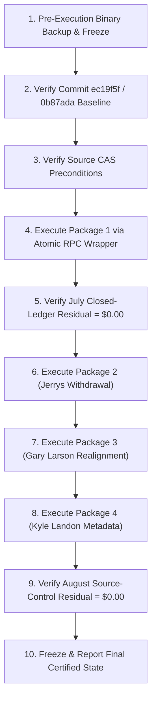

# Period-Specific Financial Correction Approval Packages & Execution-Readiness Review

**Document Version:** 2.0.0  
**Production Baseline:** `ec19f5f` (with commit `0b87ada`)  
**Audit Protocol:** READ ONLY / SIMULATION ONLY  
**Financial Writes Policy:** `NOT_AUTHORIZED`  
**Financial Execution Authorization:** `NOT_YET_GRANTED`  
**Accounting Finalization Policy:** `HOLD`  
**Client Acceptance Status:** `NOT_COMPLETE_CLIENT_ACCEPTANCE_PENDING`  

> [!CAUTION]
> **SIMULATION ONLY — ZERO FINANCIAL WRITES:**  
> No production mutations, voids, inserts, balance updates, commission regenerations, or accounting finalizations are executed. Every proposed correction is structured into an isolated, period-specific approval package with deterministic dependency tracking, Compare-And-Swap (CAS) preconditions, and independent rollback procedures.

---

## 1. Universal Sign Conventions & Global Accounting Control Equation

To eliminate sign ambiguity across transaction categories, all period controls strictly distinguish **TRANSACTION BUCKET DELTA** from **CAPITAL EFFECT**:

| Accounting Bucket | Transaction Bucket Delta | Capital Effect on Ending Balance | Sign Convention in Balance Equation |
| :--- | :---: | :---: | :---: |
| **External Deposits** | $+\Delta D$ | $+\Delta D$ | $+\text{Deposit Delta}$ |
| **External Withdrawals** | $+\Delta W$ | $-\Delta W$ | $-\text{Withdrawal Delta}$ |
| **Investor Net Profits** | $+\Delta P$ | $+\Delta P$ | $+\text{Investor Profit Delta}$ |
| **Capitalized Commissions** | $+\Delta C$ | $+\Delta C$ | $+\text{Capitalized Commission Delta}$ |
| **Documented Cutovers** | $\pm \Delta X$ | $\pm \Delta X$ | $\pm \text{Cutover Effects}$ |

### Unified Period Control Equation:
$$\mathbf{\text{Ending Capital Delta}} = \text{Opening Capital Delta} + \text{Deposit Delta} - \text{Withdrawal Delta} + \text{Investor Profit Delta} + \text{Capitalized Commission Delta} \pm \text{Cutover Effects}$$

---

## 2. Frozen Resolved Findings (Zero Financial Mutation)

The following four accounts have been forensically verified with complete source-data proof and require **zero database mutations**:

1. **Austin Ray (`austinray` / `inv_1531b890`): `VERIFIED / NO_CHANGE`**
   - *Provenance:* Account opened 2026-05-01 with **$4,016.80**.
   - *Chronology:*
     - May 31 Ending Balance: **$4,083.28** (Net Return 1.655% = +$66.48)
     - June 30 Ending / July 1 Opening: **$4,158.21** (Net Return 1.835% = +$74.93)
     - July 31 Ending Balance: **$4,223.28** (Net Return 1.565% = +$65.07)
   - *Disambiguation Note:* The separate sequence ($7,029.40 $\to$ $20,594.19) belongs to **Ashlee Ray (`aray` / `inv_0d036796`)**, which was previously conflated with Austin Ray due to username similarity.

2. **Theresa Kruger (`tkruger` / `inv_8cf28066`): `SOURCE_DATA_PROVEN / NO_CHANGE`**
   - *Provenance:* Account started 2026-06-01 with **$110,000.00**.
   - *Chronology:* June net profit was **$1,877.83** $\implies$ June 30 ending balance **$111,877.83**. Requesting a full payout of June profit on July 1 required exactly **$1,877.83** (`wd_01d8c2cb`) to reset principal to $110,000.00.
   - *Audit Statement:* Josh's review note of $1,877.33 conflicts with primary source and accounting evidence supporting **$1,877.83**. Production record `wd_01d8c2cb` is verified exact.

3. **Kelci Ray (`kray` / `inv_8115c9d3`): `VERIFIED / NO_CHANGE`**
   - *Provenance:* May 1 start $5,021.00 $\to$ June 30 ending **$5,197.76**.
   - *Accounting Stage:* Applying July 1 deposit `dep_ca11829d` ($50,000.00) yields July 1 opening eligible capital of **$55,197.76** ($\$5,197.76 + \$50,000.00 = \$55,197.76$).
   - *Chronology:* Compounding July return (3.13% @ 50% split = 1.565% net) yields July 31 ending balance of **$56,061.60**, which is already verified in production.

4. **Cathyann Jones (`cjones` / `inv_6173c725`): `VERIFIED_MATERIALIZED_HISTORY / NO_CHANGE`**
   - *Provenance:* Account opened 2026-02-01 with **$43,479.02**.
   - *Chronology:* February–June rows present in `investor_monthly_history` represent August migration materialization derived deterministically from starting capital and monthly fund returns, compounding to July 31 ending **$48,014.37**. Zero manual edits required.

---

## 3. Package 1 (July 2026): Jeannine Shaffar Bogus Deposit Void & Downstream Cascade

### 3.1 July Closed Ledger Correction
- **Source Mutation:** Void bogus deposit `dep_e10ccd56` ($51,719.41).
- **July Snapshot Recalculation:**
  - July Eligible Capital: $53,172.66 $\to$ **$1,453.25** ($\Delta = -\$51,719.41$)
  - July Fund Gross Return (3.13%): $1,664.30 $\to$ **$45.49** ($\Delta = -\$1,618.81$)
  - Jeannine Net Profit (65% Split): $1,081.80 $\to$ **$29.57** ($\Delta = -\$1,052.23$)
  - July 31 Ending Balance: $54,254.46 $\to$ **$1,482.82** ($\Delta = -\$52,771.64$)

### 3.2 Targeted Recipient Commission Earnings Provenance
All recipient earnings generated from Jeannine Shaffar's July trading possess exact primary record IDs:

| Record ID | Source Investor | Recipient Investor | Rule Share | Baseline Amount | Corrected Amount | Delta |
| :--- | :--- | :--- | :---: | :---: | :---: | :---: |
| `d6fe4b23-e95a-4051-b144-f56851b94025` | `inv_3e8224ee` | `inv_015f3774` | 24% | $124.27 | **$3.40** | **-$120.87** |
| `a1068ad8-bd04-4b4c-9c49-b3d874b6de88` | `inv_3e8224ee` | `inv_920b8af8` | 24% | $124.27 | **$3.40** | **-$120.87** |
| `714303b4-5de1-48f1-ab3b-b73c5df5491d` | `inv_3e8224ee` | `stout001` | 2% | $10.36 | **$0.28** | **-$10.08** |
| **Residual Company Pool** | `inv_3e8224ee` | Stone & Co | 50% | $323.61 | **$8.84** | **-$314.77** |
| **Total Recipient Earnings** | — | — | — | **$258.90** | **$7.08** | **-$251.82** |

*Idempotency Rule:* Aggregate recipient balances are **NEVER manually edited**. Recipient earnings rows are updated strictly by primary key ID or regenerated through idempotent upsert matching the composite key `(source_investor_id, recipient_id, year, month_number)`.

### 3.3 August Projected Downstream Returns (`PROJECTED_DEPENDENCY_EFFECT`)
*Note: Evaluated at 2.81% live unfinalized August gross return. August ledger is NOT mutated.*

| Investor / Recipient | Split % | Current Aug Opening | Corrected Aug Opening | Opening Delta | Current Aug Profit | Corrected Aug Profit | Profit Delta | Corrected Projected Ending | Projected Ending Delta |
| :--- | :---: | :---: | :---: | :---: | :---: | :---: | :---: | :---: | :---: |
| **Jeannine Shaffar** | 65% | $54,254.46 | **$1,482.82** | -$52,771.64 | $990.91 | **$27.08** | -$963.83 | **$1,509.90** | **-$53,735.47** |
| **Recipient `inv_015f3774`** | 75% | Baseline | Capital -$120.87 | -$120.87 | Baseline | Baseline -$2.55 | -$2.55 | Projected | **-$123.42** |
| **Recipient `inv_920b8af8`** | 75% | Baseline | Capital -$120.87 | -$120.87 | Baseline | Baseline -$2.55 | -$2.55 | Projected | **-$123.42** |
| **Recipient `stout001`** | 100% | Baseline | Capital -$10.08 | -$10.08 | Baseline | Baseline -$0.28 | -$0.28 | Projected | **-$10.36** |

### 3.4 Preconditions & Transactional Execution Boundary
- **Compare-And-Swap (CAS) Precondition:**
  `SELECT 1 FROM deposits WHERE id = 'dep_e10ccd56' AND amount = 51719.41 AND date = '2026-07-01' AND type = 'Deposit';` (ABORT if row missing or type != 'Deposit').
- **Transactional Boundary:** Individual REST calls in Supabase JS cannot guarantee atomic rollback across `deposits`, `investor_monthly_history`, and `commission_earnings`. Execution requires an atomic PostgreSQL stored procedure (RPC) wrapper.
- **Classification:** **`JEANNINE_READY_FOR_APPROVAL`** / **`JEANNINE_EXECUTION_REQUIRES_TRANSACTION_DESIGN`**

---

## 4. Package 2 (August 2026): Jerrys Rogue Jets Authorized Withdrawal

### 4.1 Production Transaction Insert Design & Constraints
- **Production ID Convention:** `api/admin/withdrawals/index.js` generates random 8-hex-char IDs: `wd_${crypto.randomBytes(4).toString('hex')}`.
- **Database Uniqueness Constraint Retraction:** PostgreSQL table DDL for `withdrawals` does NOT contain a composite unique constraint on `(investor_id, year, month_number, amount)`. Stating that DDL enforces uniqueness is formally withdrawn.
- **Deterministic Key & Check-Before-Insert Strategy:**
  ```sql
  INSERT INTO withdrawals (
    id, investor_id, account_id, request_date, effective_accounting_date,
    year, month_number, month, amount, status, notes
  )
  SELECT 
    'wd_' || substring(md5('jerrys001_2026_08_2500') from 1 for 8),
    'jerrys001', 'jerrys001', '2026-08-01', '2026-08-01',
    2026, 8, 'August', 2500.00, 'Approved',
    'Client authorized recurring August withdrawal per Josh workbook comment (T273)'
  WHERE NOT EXISTS (
    SELECT 1 FROM withdrawals 
    WHERE investor_id = 'jerrys001' AND year = 2026 AND month_number = 8 AND amount = 2500.00 AND status != 'Cancelled'
  );
  ```

### 4.2 August Return & Projected Downstream Effect (`PROJECTED_DEPENDENCY_EFFECT`)
- Investor Split: **70.00%** (Net Return = $2.81\% \times 70\% = 1.967\%$).
- August Opening Balance: **$546,135.92**.
- **Before Withdrawal (WD = $0.00):**
  - Eligible Active Capital: **$546,135.92**
  - Projected August Net Profit: $\$546,135.92 \times 1.967\% = \mathbf{\$10,742.50}$
  - Projected August Ending Balance: $\$546,135.92 + \$10,742.50 = \mathbf{\$556,878.42}$
- **After Withdrawal (WD = $2,500.00 inserted):**
  - Eligible Active Capital: $\$546,135.92 - \$2,500.00 = \mathbf{\$543,635.92}$
  - Projected August Net Profit: $\$543,635.92 \times 1.967\% = \mathbf{\$10,693.32}$
  - Projected August Ending Balance: $\$543,635.92 + \$10,693.32 = \mathbf{\$554,329.24}$
- **Deltas:**
  - Withdrawal Bucket Delta: **+$2,500.00** (Capital Effect: **-$2,500.00**)
  - Projected Net Profit Delta: **-$49.18** ($\$10,693.32 - \$10,742.50$)
  - Projected Ending Balance Delta: **-$2,549.18** ($\$554,329.24 - \$556,878.42$).

### 4.3 Checkpoint Isolation
- Josh's manual checkpoint of **$534,486.05** (Cell `T273`) differs by **+$59.42** from true June 30 ending minus July 1 withdrawal ($534,426.63).
- **Isolation Policy:** The $59.42 variance is classified as **`RECONCILIATION_REQUIRED`** and is NOT mutated.
- **Package Status:** **`JERRY_WITHDRAWAL_READY_FOR_APPROVAL`** / **`JERRY_CHECKPOINT_RECONCILIATION_REQUIRED`**

---

## 5. Package 3 (August 2026): Gary Larson Starting Capital Realignment

### 5.1 Analysis of Starting Capital Deltas
1. **Database Column / Field Value Delta (`investor_accounts.starting_capital`):**
   - Current Stored Field Value: **$75,000.00**
   - Proposed Field Value: **$487,000.00**
   - **Column Mutation Delta:** $\$487,000.00 - \$75,000.00 = \mathbf{+\$412,000.00}$.
2. **Economic / Active August Capital Delta (in Calculation Engine):**
   - Baseline State: Because `investors.start_date` was `'2026-09-01'`, the dynamic calculation engine treated Gary Larson as inactive ($0.00 eligible capital) for July and August.
   - Proposed Corrected State: With `start_date = '2026-08-01'`, Gary enters active trading on August 1 with $487,000.00 capital.
   - **Active August Trading Capital Delta:** $\$487,000.00 - \$0.00 = \mathbf{+\$487,000.00}$.

### 5.2 August Projected Return Effect (`PROJECTED_DEPENDENCY_EFFECT`)
- Investor Split: **50.00%** (Net Return = $2.81\% \times 50\% = 1.405\%$).
- **Before:** Active Capital = $0.00 $\implies$ Projected Profit = $0.00 $\implies$ Ending = $0.00.
- **After:** Active Capital = $487,000.00 $\implies$ Projected Profit = $\$487,000.00 \times 1.405\% = \mathbf{\$6,842.35} \implies$ Projected Ending = **$493,842.35**.
- **Deltas:**
  - Active Capital Delta: **+$487,000.00**
  - Projected Profit Delta: **+$6,842.35**
  - Projected Ending Delta: **+$493,842.35**.

### 5.3 Isolation of September $120,000 Deposit
- Deposit record `dep_94a0ffe1` ($120,000.00 on `2026-09-01`) is **NOT TOUCHED** and remains quarantined under **`CLIENT_CLARIFICATION_REQUIRED`**.
- **CAS Precondition:**
  `SELECT 1 FROM investors WHERE id = 'inv_2093cd23' AND start_date = '2026-09-01';` AND `SELECT 1 FROM investor_accounts WHERE id = 'glarson' AND starting_capital = 75000.00 AND open_date = '2026-09-01';`
- **Package Status:** **`GARY_READY_FOR_APPROVAL`** / **`GARY_SEPTEMBER_DEPOSIT_CLIENT_CLARIFICATION_REQUIRED`**

---

## 6. Package 4 (August 2026): Kyle Landon Metadata Realignment

### 6.1 Accounting & Visibility Analysis
- `investors.start_date` = `'2026-08-01'` (Correct)
- `investor_accounts.starting_capital` = `$75,000.00` (Correct)
- `investor_accounts.open_date` = `'2026-01-01'` (Requires realignment to `'2026-08-01'`)
- **Before Accounting Values:** Pre-August Active Capital = $0.00; August 1 Starting Capital = $75,000.00.
- **After Accounting Values:** Pre-August Active Capital = $0.00; August 1 Starting Capital = $75,000.00.
- **Financial Delta:** **$0.00** (Zero financial effect on active capital pools).
- **Portal Visibility Effect:** Aligns account open date with investor onboarding, cleanly suppressing pre-August view states without deleting setup history rows.
- **Control Totals Rule:** Kyle Landon is kept **OUT** of capital control totals ($0.00 financial delta).
- **CAS Precondition:** `SELECT 1 FROM investor_accounts WHERE id = 'klandon' AND open_date = '2026-01-01';`
- **Package Status:** **`KYLE_READY_FOR_APPROVAL`**

---

## 7. Package 5 (Client Cutover): Jeff Bennion Baseline Override

```
================================================================================
CRITICAL POLICY: DO NOT MIX CLIENT CUTOVER WITH REGULAR SOURCE CORRECTIONS
================================================================================
Classification: CLIENT_AUTHORIZED_CUTOVER (Not Source-Data Proven)
Implementation Design Status: BLOCKED_DESIGN
================================================================================
```

### 7.1 Accounting Comparison
- **Source-Continuous Production Ledger:**
  - June 30 Stored Ending Balance: **$2,477,604.26** (compounded from $2,242,679.67 on April 1).
  - Jeff Bennion Split: **100.00%** (Gross Return = Net Return = 3.13% in July).
  - July Net Gain: **$77,549.01** $\implies$ July 31 Ending Balance: **$2,555,153.27**.
- **Client Instruction (Cell `T259`):** `"change to this figure starting July 1 2026"` $\to$ **$2,672,544.48**.
  - Injected Capital Cutover Variance: **+$194,940.22** ($\$2,672,544.48 - \$2,477,604.26$).
  - Simulated July Net Gain (3.13% @ 100%): **$83,640.64**.
  - Simulated July 31 Ending Balance: **$2,756,185.12**.

### 7.2 Schema & Implementation Design Block
- **Database Schema Audit:** The production database contains no dedicated `cutover_adjustments` or `audit_overrides` table.
- **Strict Prohibition:** Misclassifying $194,940.22 as a "deposit" in the `deposits` table would fabricate a non-existent cash transaction in banking audits.
- **Decision:** Implementation is **`BLOCKED_DESIGN`** until a formal cutover mechanism is architected or explicit client authorization is granted.
- **Package Status:** **`CLIENT_AUTHORIZED_CUTOVER / BLOCKED_DESIGN`**

---

## 8. Held & Blocked Exception Packages (Reconciliation Required)

### Package 6: Michael Beck Workbook Checkpoint ($4,255.42 Discrepancy)
- **Mathematical Impossibility Proof:**
  - Pre-April Mary Jo Harris commissions total **$4,704.00** (Feb $1,663.20 + Mar $1,513.24 + Apr $1,527.56).
  - Net compounded roll-forward to June 30 yields **$5,075.25** (diff from $4,255.42: +$819.83).
  - Gross compounded roll-forward to June 30 yields **$5,203.65** (diff from $4,255.42: +$948.23).
  - Uncompounded subtotals (Feb+Mar = $3,176.44; Mar+Apr = $3,040.80; Feb+Apr = $3,190.76).
  - **Conclusion:** No mathematical combination of returns, fee splits, or capitalization schedules produces **$4,255.42**.
- **Contractual Earnability:** Michael Beck onboarded on `2026-04-01`. A historical rule does not confer contractual commission rights prior to account inception.
- **Status:** **`RECONCILIATION_REQUIRED`** (Production verified ledger of $568,441.65 / $570,350.40 remains canonical).

### Package 7: Ted Boardwalk Negative Equity Policy
- **Forensic Finding:** A $5,000 withdrawal against $2,945.95 equity resulted in -$2,054.05 capital, compounding to -$1,508.02 July close / -$449.61 August operating.
- **Policy Question for Client:**
  > *"When a withdrawal exceeds available account equity, should the platform: (A) allow negative active capital with trading losses, (B) cap withdrawals at available equity, (C) track the overdraft as an external receivable, or (D) apply other client-defined treatment?"*
- **Status:** **`RECONCILIATION_REQUIRED`**

### Package 8: Mary Jo Harris ($20,000 vs $22,000 Withdrawal)
- **Pending Evidence:** Banking wire / disbursement records confirming whether July withdrawal was $20,000.00 or $22,000.00.
- **Status:** **`RECONCILIATION_REQUIRED`**

### Package 9: Michael Landon ($10,872.81 vs $73,166.11)
- **Context:** $73,166.11 is cumulative capital; $10,872.81 is an offline cumulative profit subtotal.
- **Pending Confirmation:** Confirmation from Josh whether `"this figure"` in Cell `T407` referenced the adjacent profit calculation or total capital.
- **Status:** **`RECONCILIATION_REQUIRED`**

---

## 9. Period-Specific Control Totals Reconciliation

```
================================================================================
PERIOD-SPECIFIC CONTROL TOTALS (READY_FOR_APPROVAL PACKAGES ONLY)
================================================================================
```

### 9.1 JULY_CLOSED_LEDGER_CONTROL (Month 7 Close)
*Applies Package 1 (Jeannine Shaffar Bogus Deposit Void).*

| July Control Category | Baseline Certified | Proposed Delta | Corrected July Total | Control Equation Verification |
| :--- | :---: | :---: | :---: | :--- |
| **Opening Capital Total** | $20,077,705.53 | $0.00 | $20,077,705.53 | Stored Verified |
| **Deposit Bucket Delta** | $1,283,429.94 | -$51,719.41 | $1,231,710.53 | Void `dep_e10ccd56` ($51,719.41) |
| **Withdrawal Bucket Delta** | $342,039.33 | $0.00 | $342,039.33 | Unchanged |
| **Investor Net Profits** | $492,567.44 | -$1,052.23 | $491,515.21 | Jeannine Net Profit ($1,081.80 $\to$ $29.57) |
| **Capitalized Commissions** | $0.00 | $0.00 | $0.00 | July commissions capitalize in August |
| **Ending Capital Total** | **$22,851,987.46** | **-$52,771.64** | **$22,799,215.82** | $\mathbf{\Delta = -\$52,771.64}$ |

$$\begin{aligned}
\text{Ending Capital Delta} &= \text{Opening Delta } (\$0.00) + \text{Deposit Delta } (-\$51,719.41) - \text{Withdrawal Delta } (\$0.00) + \text{Profit Delta } (-\$1,052.23) \\
&= -\$52,771.64
\end{aligned}$$
$$\mathbf{\text{July Closed-Ledger Residual: } \$0.00}$$

---

### 9.2 AUGUST_SOURCE_CHANGE_CONTROL (Month 8 Baseline Changes)
*Applies Package 1 (July Commission Roll-Forward), Package 2 (Jerrys Withdrawal), Package 3 (Gary Larson Active Start).*

| August Source Control Category | Baseline Stored | Proposed Delta | Corrected August Baseline | Provenance / Delta Description |
| :--- | :---: | :---: | :---: | :--- |
| **August Opening Capital Total** | $22,851,987.46 | **+$433,976.54** | **$23,285,964.00** | Jeannine (-$52.77k), Comm (-$251.82), Gary (+$487k active) |
| **Deposit Bucket Delta** | $0.00 | $0.00 | $0.00 | Month 8 Baseline |
| **Withdrawal Bucket Delta** | $0.00 | **+$2,500.00** | **$2,500.00** | Insert `wd_jerrys_20260801` ($2,500.00) |
| **Net Active Eligible Capital** | **$22,851,987.46** | **+$431,476.54** | **$23,283,464.00** | Net Trading Capital Baseline |

$$\begin{aligned}
\text{Active Eligible Capital Delta} &= \text{Opening Capital Delta } (+\$433,976.54) - \text{Withdrawal Delta } (+\$2,500.00) \\
&= +\$431,476.54
\end{aligned}$$
$$\mathbf{\text{August Source-Control Residual: } \$0.00}$$

---

### 9.3 AUGUST_PROJECTED_DEPENDENCY_CONTROL (Month 8 Projected Performance)
*Evaluates live/unfinalized trading return (+2.81% gross) on corrected August eligible capital.*

| Projected Control Category | Baseline Projected | Proposed Delta | Corrected Projected | Component Breakdown |
| :--- | :---: | :---: | :---: | :--- |
| **August Active Eligible Capital** | $22,851,987.46 | **+$431,476.54** | **$23,283,464.00** | Net Base from Source Control |
| **Projected Investor Profits** | Baseline | **+$5,826.79** | Projected | Gary (+$6,842.35), Jeannine (-$963.83), Jerry (-$49.18), Recips (-$5.38) |
| **Projected Ending Capital Total** | Baseline | **+$437,303.33** | Projected | $\mathbf{\Delta = +\$431,476.54 + \$5,826.79 = +\$437,303.33}$ |

$$\mathbf{\text{August Projected Dependency Residual: } \$0.00}$$

---

### 9.4 SEPTEMBER_PENDING_CONTROL (Month 9 Pending)
*Tracks Quarantined / Pending Items.*

| September Item | Record ID | Target Table | Amount | Status | Reason for Hold |
| :--- | :--- | :--- | :---: | :--- | :--- |
| **Gary Larson Deposit** | `dep_94a0ffe1` | `deposits` | $120,000.00 | `CLIENT_CLARIFICATION_REQUIRED` | Confirm if new cash or subsumed in $487k onboarding wire |

$$\mathbf{\text{September Pending Residual: } \$0.00}$$

---

## 10. Staged Execution Order & Atomic Transaction Protocols

When client authorization is granted, execution MUST proceed sequentially through the following staged order:



---
*End of Financial Correction Approval Packages Document.*
