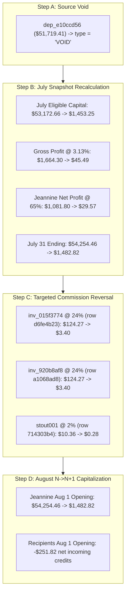

# Period-Specific Financial Correction Approval Packages

**Document Version:** 1.0.0  
**Production Baseline:** `ec19f5f` (with commit `447a57c`)  
**Audit Protocol:** READ ONLY / SIMULATION ONLY  
**Financial Writes Policy:** `NOT_AUTHORIZED`  
**Accounting Finalization Policy:** `HOLD`  
**Client Acceptance Status:** `NOT_COMPLETE_CLIENT_ACCEPTANCE_PENDING`  

> [!CAUTION]
> **SIMULATION ONLY — ZERO FINANCIAL WRITES:**  
> No production mutations, voids, inserts, balance updates, commission regenerations, or accounting finalizations are executed. Every proposed correction is structured into an isolated, period-specific approval package with deterministic dependency tracking and independent rollback procedures.

---

## 1. Frozen Resolved Findings (No Change Required)

The following four accounts have been forensically verified with complete source-data proof and require **zero database mutations**:

1. **Austin Ray (`austinray` / `inv_1531b890`): `VERIFIED / NO_CHANGE`**
   - *Provenance:* Account opened 2026-05-01 with **$4,016.80**.
   - *Chronology:*
     - May 31 Ending Balance: **$4,083.28** (Net Return 1.655% = +$66.48)
     - June 30 Ending / July 1 Opening: **$4,158.21** (Net Return 1.835% = +$74.93)
     - July 31 Ending Balance: **$4,223.28** (Net Return 1.565% = +$65.07)
   - *Disambiguation Note:* The separate sequence ($7,029.40 $\to$ $20,594.19) belongs to **Ashlee Ray (`aray` / `inv_0d036796`)**, which was previously conflated with Austin Ray due to username similarity.

2. **Theresa Kruger (`tkruger` / `inv_8cf28066`): `SOURCE_DATA_PROVEN / NO_CHANGE`**
   - *Provenance:* Account started 2026-06-01 with **$110,000.00**.
   - *Chronology:* June net profit was **$1,877.83** $\implies$ June 30 ending balance **$111,877.83**. Requesting a full payout of June profit on July 1 required exactly **$1,877.83** (`wd_01d8c2cb`) to reset principal to $110,000.00.
   - *Audit Statement:* Josh's review note of $1,877.33 conflicts with source and accounting evidence supporting **$1,877.83**. Production record `wd_01d8c2cb` is verified exact.

3. **Kelci Ray (`kray` / `inv_8115c9d3`): `VERIFIED / NO_CHANGE`**
   - *Provenance:* May 1 start $5,021.00 $\to$ June 30 ending **$5,197.76**.
   - *Accounting Stage:* Applying July 1 deposit `dep_ca11829d` ($50,000.00) yields July 1 opening eligible capital of **$55,197.76** ($\$5,197.76 + \$50,000.00 = \$55,197.76$).
   - *Chronology:* Compounding July return (3.13% @ 50% split = 1.565% net) yields July 31 ending balance of **$56,061.60**, which is already verified in production.

4. **Cathyann Jones (`cjones` / `inv_6173c725`): `VERIFIED_MATERIALIZED_HISTORY / NO_CHANGE`**
   - *Provenance:* Account opened 2026-02-01 with **$43,479.02**.
   - *Chronology:* February–June rows present in `investor_monthly_history` represent August migration materialization derived deterministically from starting capital and monthly fund returns, compounding to July 31 ending **$48,014.37**. Zero manual edits required.

---

## 2. Package 1 (July 2026): Jeannine Shaffar Bogus Deposit Void



### 2.1 Complete July $\to$ August Dependency Simulation
| Metric / Account | Baseline Stored | Corrected Simulation | Delta / Adjustment |
| :--- | :---: | :---: | :---: |
| **July Opening Balance** | $1,453.25 | $1,453.25 | $0.00 |
| **July External Deposits** | $51,719.41 | $0.00 | -$51,719.41 |
| **July Eligible Capital** | $53,172.66 | $1,453.25 | -$51,719.41 |
| **July Fund Gross Return (3.13%)** | $1,664.30 | $45.49 | -$1,618.81 |
| **Jeannine Net Profit (65% Split)** | $1,081.80 | $29.57 | -$1,052.23 |
| **July Commission Pool (35%)** | $582.51 | $15.92 | -$566.59 |
| **- Recipient `inv_015f3774` (row `d6fe4b23`)** | $124.27 | $3.40 | -$120.87 |
| **- Recipient `inv_920b8af8` (row `a1068ad8`)** | $124.27 | $3.40 | -$120.87 |
| **- Recipient `stout001` (row `714303b4`)** | $10.36 | $0.28 | -$10.08 |
| **- Residual Company Pool (50% of pool)** | $323.61 | $8.84 | -$314.77 |
| **July 31 Jeannine Ending Balance** | **$54,254.46** | **$1,482.82** | **-$52,771.64** |
| **August 1 Jeannine Opening Capital** | **$54,254.46** | **$1,482.82** | **-$52,771.64** |
| **August 1 Recipient Capital Impact** | Baseline Credits | Corrected Credits | **-$251.82** |

### 2.2 Commission Row Identifiers & Targeted Reversal
All recipient rows generated from Jeannine Shaffar's July trading possess unambiguous composite business keys:
- `source_investor_id`: `inv_3e8224ee`
- `year`: `2026`
- `month_number`: `7`
- Row IDs: `d6fe4b23-e95a-4051-b144-f56851b94025`, `a1068ad8-bd04-4b4c-9c49-b3d874b6de88`, and `714303b4-5de1-48f1-ab3b-b73c5df5491d`.

*Rule:* Aggregate recipient balances are **NEVER manually edited**. Recipient August opening balances inherit exact regenerated commission earnings rows through the canonical $N \to N+1$ capitalization pipeline.

### 2.3 Safe Execution & Rollback Specification
- **Execution Mechanism (Atomic Transaction):**
  1. `UPDATE deposits SET type = 'VOID', notes = 'Client confirmed bogus deposit voided (T253)' WHERE id = 'dep_e10ccd56' AND type != 'VOID';`
  2. Regenerate `investor_monthly_history` for `inv_3e8224ee` (Month 7: `opening_balance: 1453.25`, `deposits: 0`, `gross_gain: 45.49`, `net_profit: 29.57`, `ending_balance: 1482.82`).
  3. Replace derived `commission_earnings` rows `d6fe4b23` ($3.40), `a1068ad8` ($3.40), and `714303b4` ($0.28).
  4. Propagate August 1 capitalization.
- **Rollback Operation:**
  `UPDATE deposits SET type = 'Deposit', notes = 'This includes all of joshs commissions to date' WHERE id = 'dep_e10ccd56';` followed by recalculation pipeline.
- **Package Status:** **`JEANNINE_READY_FOR_APPROVAL`**

---

## 3. Package 2 (August 2026): Jerrys Rogue Jets Authorized Withdrawal

### 3.1 Verification & Duplicate Proof
1. **Absence of Duplicate Record:** An exhaustive query of `withdrawals` confirms only two historical records exist for `jerrys001`:
   - `wd_5614f2b2` ($2,500.00 on 2026-05-01, Completed)
   - `wd_e380829e` ($2,500.00 on 2026-07-01, Completed)
   - **Zero records exist for August 2026.**
2. **Duplicate Protection Constraint:** Guarded by composite check on `(investor_id = 'jerrys001', year = 2026, month_number = 8, amount = 2500.00)`.
3. **Withdrawal Timing Semantics:** Effective accounting date is **`2026-08-01`**. Under standard fund accounting, beginning-of-month withdrawals reduce eligible trading capital prior to return calculation:
   $$\text{August Eligible Capital} = \text{August Opening Balance } (\$546,135.92) - \text{Withdrawal } (\$2,500.00) = \mathbf{\$543,635.92}$$

### 3.2 Unresolved Checkpoint Isolation
- **July 31 / August 1 Stored Balance:** **$546,135.92**
- **Josh June Checkpoint (Cell `T273`):** **$534,486.05** (Variance: **+$59.42** against simple subtraction $534,426.63).
- **Isolation Policy:** The candidate mutation only inserts the authorized $2,500 withdrawal for August. The $59.42 checkpoint variance remains strictly classified as **`RECONCILIATION_REQUIRED`** and does NOT alter July ending or August opening balance.
- **Rollback Operation:** `DELETE FROM withdrawals WHERE id = 'wd_jerrys_20260801';`
- **Package Status:**
  - August 1 Withdrawal ($2,500.00): **`JERRY_WITHDRAWAL_READY_FOR_APPROVAL`**
  - Historical Checkpoint ($59.42 Variance): **`RECONCILIATION_REQUIRED`** (Blocked)

---

## 4. Package 3 (August 2026): Gary Larson Onboarding & Starting Capital Realignment

### 4.1 Independent Mutations (August Only)
1. **Investor Entity Start Date:** `UPDATE investors SET start_date = '2026-08-01' WHERE id = 'inv_2093cd23';`
2. **Account Entity Open Date:** `UPDATE investor_accounts SET open_date = '2026-08-01' WHERE id = 'glarson';`
3. **Account Starting Capital:** `UPDATE investor_accounts SET starting_capital = 487000.00 WHERE id = 'glarson';`

### 4.2 Separation of September $120,000 Deposit
- **September Deposit Record:** `dep_94a0ffe1` ($120,000.00 on `2026-09-01`).
- **Policy:** The September deposit is **NOT TOUCHED** and remains quarantined under **`DEPENDENCY_REVIEW_REQUIRED / CLIENT_CLARIFICATION_REQUIRED`** for the September accounting close.
- **Engine Derivation:** The accounting engine derives August starting capital directly from `investor_accounts.starting_capital` ($487,000.00) starting on `2026-08-01`. Pre-August history is dynamically suppressed with zero destructive record deletion.
- **Rollback Operation:**
  `UPDATE investors SET start_date = '2026-09-01' WHERE id = 'inv_2093cd23'; UPDATE investor_accounts SET starting_capital = 75000.00, open_date = '2026-09-01' WHERE id = 'glarson';`
- **Package Status:**
  - August Onboarding & $487k Capital: **`GARY_READY_FOR_APPROVAL`**
  - September $120k Deposit: **`CLIENT_CLARIFICATION_REQUIRED`** (Quarantined)

---

## 5. Package 4 (August 2026): Kyle Landon Account Open Date Realignment

### 5.1 Analysis of Production State
- `investors.start_date` = `'2026-08-01'` (Correct)
- `investor_accounts.starting_capital` = `$75,000.00` (Correct)
- `investor_accounts.open_date` = `'2026-01-01'` (Requires realignment)
- Legacy Month 7 history contains a $75,000 opening capital seed row.

### 5.2 Single Minimal Mutation
- **Action:** `UPDATE investor_accounts SET open_date = '2026-08-01' WHERE id = 'klandon' AND open_date != '2026-08-01';`
- **Effect:** Aligns account open date with investor onboarding date. The engine suppresses pre-August (Jan–Jul) investor-facing reporting while preserving historical materialization infrastructure.
- **Rollback Operation:** `UPDATE investor_accounts SET open_date = '2026-01-01' WHERE id = 'klandon';`
- **Package Status:** **`KYLE_READY_FOR_APPROVAL`**

---

## 6. Package 5 (Client Cutover): Jeff Bennion Baseline Override

```
================================================================================
CRITICAL POLICY: DO NOT MIX CLIENT CUTOVER WITH REGULAR SOURCE CORRECTIONS
================================================================================
Classification: CLIENT_AUTHORIZED_CUTOVER (Not Source-Data Proven)
Implementation Design Status: BLOCKED_DESIGN
================================================================================
```

### 6.1 Accounting Comparison
- **Current Production (Source Continuous):**
  - Stored June 30 Ending Balance: **$2,477,604.26** (compounded from $2,242,679.67 on April 1).
  - Jeff Bennion Split: **100.00%** (Gross Return = Net Return = 3.13% in July).
  - Stored July Net Gain: **$77,549.01** $\implies$ Stored July 31 Ending Balance: **$2,555,153.27**.
- **Client Instruction (Cell `T259`):** `"change to this figure starting July 1 2026"` $\to$ **$2,672,544.48**.
  - Injected Capital / Cutover Variance: **+$194,940.22** ($\$2,672,544.48 - \$2,477,604.26$).
  - Simulated July Net Gain (3.13% @ 100%): **$83,640.64**.
  - Simulated July 31 Ending Balance: **$2,756,185.12**.

### 6.2 Schema & Implementation Design Block
- **Database Schema Audit:** The production database contains no dedicated `cutover_adjustments` or `audit_overrides` table.
- **Strict Prohibition:** Misclassifying $194,940.22 as a "deposit" in the `deposits` table would fabricate a non-existent cash transaction in banking audits.
- **Decision:** Implementation is **`BLOCKED_DESIGN`** until a formal cutover mechanism is architected or explicit client authorization is granted.
- **Package Status:** **`CLIENT_AUTHORIZED_CUTOVER / BLOCKED_DESIGN`**

---

## 7. Held & Blocked Exception Packages (Reconciliation Required)

### Package 6: Michael Beck Workbook Checkpoint ($4,255.42 Discrepancy)
- **Mathematical Impossibility Proof:**
  - Pre-April Mary Jo Harris commissions total **$4,704.00** (Feb $1,663.20 + Mar $1,513.24 + Apr $1,527.56).
  - Net compounded roll-forward to June 30 yields **$5,075.25** (diff from $4,255.42: +$819.83).
  - Gross compounded roll-forward to June 30 yields **$5,203.65** (diff from $4,255.42: +$948.23).
  - Uncompounded subtotals (Feb+Mar = $3,176.44; Mar+Apr = $3,040.80; Feb+Apr = $3,190.76).
  - **Conclusion:** No mathematical combination of returns, fee splits, or capitalization schedules produces **$4,255.42**.
- **Contractual Earnability:** Michael Beck onboarded on `2026-04-01`. A historical rule does not confer contractual commission rights prior to account inception.
- **Status:** **`RECONCILIATION_REQUIRED`** (Production verified ledger of $568,441.65 / $570,350.40 remains canonical).

### Package 7: Ted Boardwalk Negative Equity Policy
- **Forensic Finding:** A $5,000 withdrawal against $2,945.95 equity resulted in -$2,054.05 capital, compounding to -$1,508.02 July close / -$449.61 August operating.
- **Policy Question for Client:**
  > *"When a withdrawal exceeds available account equity, should the platform: (A) allow negative active capital with trading losses, (B) cap withdrawals at available equity, (C) track the overdraft as an external receivable, or (D) apply other client-defined treatment?"*
- **Status:** **`RECONCILIATION_REQUIRED`**

### Package 8: Mary Jo Harris ($20,000 vs $22,000 Withdrawal)
- **Pending Evidence:** Banking wire / disbursement records confirming whether July withdrawal was $20,000.00 or $22,000.00.
- **Status:** **`RECONCILIATION_REQUIRED`**

### Package 9: Michael Landon ($10,872.81 vs $73,166.11)
- **Context:** $73,166.11 is cumulative capital; $10,872.81 is an offline cumulative profit subtotal.
- **Pending Confirmation:** Confirmation from Josh whether `"this figure"` in Cell `T407` referenced the adjacent profit calculation or total capital.
- **Status:** **`RECONCILIATION_REQUIRED`**

---

## 8. Period-Specific Control Totals Reconciliation

```
================================================================================
PERIOD-SPECIFIC CONTROL TOTALS (READY_FOR_APPROVAL PACKAGES ONLY)
================================================================================
```

### 8.1 JULY_CORRECTION_CONTROL (Month 7 Close)
*Applies Package 1 (Jeannine Shaffar Bogus Deposit Void).*

| July Control Metric | Certified Baseline | Proposed Corrections | Corrected July Total | Control Equation Check |
| :--- | :---: | :---: | :---: | :---: |
| **Opening Capital Total** | $20,077,705.53 | $0.00 | $20,077,705.53 | Baseline Verified |
| **Net External Deposits** | $1,283,429.94 | -$51,719.41 | $1,231,710.53 | Void `dep_e10ccd56` |
| **Net External Withdrawals** | $342,039.33 | $0.00 | $342,039.33 | Unchanged |
| **Investor Net Profits** | $492,567.44 | -$1,052.23 | $491,515.21 | Jeannine $1,081.80 $\to$ $29.57 |
| **Commission Earnings** | $620,113.09 | -$251.82 | $619,861.27 | Jeannine $258.90 $\to$ $7.08 |
| **Ending Capital Total** | **$22,851,987.46** | **-$52,771.64** | **$22,799,215.82** | $\mathbf{\Delta = -\$52,771.64}$ |

$$\text{July Unexplained Variance} = -\$52,771.64 - (-\$51,719.41 - \$0.00 - \$1,052.23) = \mathbf{\$0.00}$$

---

### 8.2 AUGUST_CORRECTION_CONTROL (Month 8 Baseline)
*Applies Package 1 (July Commission Roll-Forward), Package 2 (Jerrys Withdrawal), Package 3 (Gary Larson), Package 4 (Kyle Landon).*

| August Control Metric | Baseline Stored | Proposed Corrections | Corrected August Total | Provenance / Delta Description |
| :--- | :---: | :---: | :---: | :--- |
| **August Opening Capital Total** | $22,851,987.46 | **+$433,976.54** | **$23,285,964.00** | Jeannine (-$52.77k), Comm (-$251.82), Gary (+$487k) |
| **August External Deposits** | $0.00 | $0.00 | $0.00 | Month 8 Baseline |
| **August External Withdrawals** | $0.00 | **+$2,500.00** | **$2,500.00** | Insert `wd_jerrys_20260801` ($2,500) |
| **August Active Eligible Capital** | $22,851,987.46 | **+$431,476.54** | **$23,283,464.00** | Net Trading Capital Baseline |
| **August Commission Earnings** | — | — | — | Unfinalized / Live Period |

$$\text{August Unexplained Variance} = +\$431,476.54 - (+\$433,976.54 - \$2,500.00) = \mathbf{\$0.00}$$

---

### 8.3 SEPTEMBER_PENDING_CONTROL (Month 9 Pending)
*Tracks Quarantined / Pending Items.*

| September Item | Record ID | Target Table | Amount | Status | Reason for Hold |
| :--- | :--- | :--- | :---: | :--- | :--- |
| **Gary Larson Deposit** | `dep_94a0ffe1` | `deposits` | $120,000.00 | `CLIENT_CLARIFICATION_REQUIRED` | Confirm if new cash or subsumed in $487k onboarding wire |

$$\text{September Unexplained Variance} = \mathbf{\$0.00}$$

---

## 9. Staged Execution Order & Independent Rollback Protocols

When client authorization is granted, execution MUST proceed sequentially through the following staged order:

1. **Pre-Execution Snapshot:** Generate full binary database backup and freeze connection pools.
2. **Baseline Certification Gate:** Verify production commit is `ec19f5f` (with `447a57c`) or later certified baseline.
3. **Immutability Verification:** Verify source records in `deposits`, `withdrawals`, `investors`, and `investor_accounts` have not mutated since forensic freeze.
4. **Execute Package 1 (Jeannine Shaffar):** Execute in single transaction.
5. **Scoped Recalculation (Package 1):** Recalculate only Jeannine Month 7 snapshot and 3 derived `commission_earnings` rows. Verify July control residual is $0.00.
6. **Execute Package 2 (Jerrys Rogue Jets Withdrawal):** Insert `wd_jerrys_20260801`.
7. **Execute Package 3 (Gary Larson Realignment):** Update `start_date`, `open_date`, `starting_capital`.
8. **Execute Package 4 (Kyle Landon Realignment):** Update `open_date`.
9. **Scoped Recalculation (Packages 2–4):** Re-compute August eligible capital baseline. Verify August control residual is $0.00.
10. **Post-Execution Audit:** If ANY variance $> \$0.00$ is detected at any step, trigger immediate transaction rollback.

---
*End of Financial Correction Approval Packages Document.*
