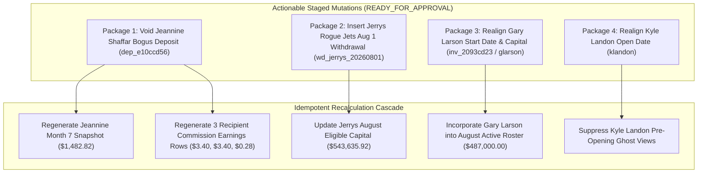

# Controlled Financial Correction Draft Manifest

**Document Version:** 2.0.0  
**Production Baseline:** `ec19f5f` (with commit `0b87ada`)  
**Manifest Status:** STAGED DRAFT — ZERO MUTATIONS EXECUTED  
**Financial Writes Policy:** `NOT_AUTHORIZED`  
**Financial Execution Authorization:** `NOT_YET_GRANTED`  
**Accounting Finalization Policy:** `HOLD`  

> [!CAUTION]
> **READ-ONLY DRAFT ONLY:** DO NOT EXECUTE THIS MANIFEST. No database writes, transaction voids, balance alterations, or commission regenerations may be performed without explicit, written client approval.

---

## 1. Actionable Mutations Overview (READY_FOR_APPROVAL Only)

Only exceptions meeting the strict standard of **proven primary source evidence**, **exact reproducible dependency graphs**, and **$0.00 unexplained simulation variance** are staged as actionable mutations in this draft manifest.



---

## 2. Detailed Staged Mutation Specifications & Compare-And-Swap (CAS) Preconditions

### Mutation 1: Void Jeannine Shaffar Bogus Deposit (Package 1)
* **Target Table:** `deposits`
* **Record ID:** `dep_e10ccd56`
* **Investor ID:** `inv_3e8224ee`
* **Account ID:** `jshaffar`
* **Existing Value:** `type: "Deposit"`, `amount: 51719.41`, `date: "2026-07-01"`
* **Proposed Value:** `type: "VOID"`, `notes: "Client confirmed bogus deposit voided per Josh workbook comment (T253)"`
* **Effective Date:** `2026-07-01`
* **Evidence:** Client review Cell `T253` — `"Bogus Deposit. Will not let me void"`; database record `dep_e10ccd56`.
* **CAS Precondition:**
  ```sql
  -- ABORT if deposit missing or already modified
  SELECT 1 FROM deposits 
  WHERE id = 'dep_e10ccd56' AND amount = 51719.41 AND date = '2026-07-01' AND type = 'Deposit';
  ```
* **Downstream Recalculation Scope:**
  1. `investor_monthly_history` for `inv_3e8224ee` (Year: 2026, Month: 7):
     - `opening_balance`: `$1,453.25`
     - `deposits`: `$0.00`
     - `gross_gain`: `$45.49`
     - `net_profit`: `$29.57`
     - `ending_balance`: `$1,482.82`
  2. `commission_earnings` (Year: 2026, Month: 7, Source: `inv_3e8224ee`):
     - Row `d6fe4b23-e95a-4051-b144-f56851b94025` (Recipient `inv_015f3774` @ 24%): `$124.27` $\to$ **`$3.40`**
     - Row `a1068ad8-bd04-4b4c-9c49-b3d874b6de88` (Recipient `inv_920b8af8` @ 24%): `$124.27` $\to$ **`$3.40`**
     - Row `714303b4-5de1-48f1-ab3b-b73c5df5491d` (Recipient `stout001` @ 2%): `$10.36` $\to$ **`$0.28`**
* **Expected Resulting Balance:**
  - July 31 Ending Balance: **$1,482.82** (down from $54,254.46)
  - August 1 Capitalization: **$1,482.82**
* **Transactional Boundary Classification:** **`JEANNINE_EXECUTION_REQUIRES_TRANSACTION_DESIGN`** (Must execute inside an atomic server-side RPC procedure).
* **Rollback Procedure:**
  ```sql
  UPDATE deposits SET type = 'Deposit', notes = 'This includes all of joshs commissions to date' WHERE id = 'dep_e10ccd56';
  ```

---

### Mutation 2: Insert Jerrys Rogue Jets Authorized August 1 Withdrawal (Package 2)
* **Target Table:** `withdrawals`
* **Record ID:** Deterministic key derived from payload: `'wd_' || substring(md5('jerrys001_2026_08_2500') from 1 for 8)`
* **Investor ID:** `jerrys001`
* **Account ID:** `jerrys001`
* **Existing Value:** No record present for August 1, 2026.
* **Proposed Value:**
  ```json
  {
    "id": "wd_53a479d2",
    "investor_id": "jerrys001",
    "account_id": "jerrys001",
    "request_date": "2026-08-01",
    "effective_accounting_date": "2026-08-01",
    "year": 2026,
    "month_number": 8,
    "month": "August",
    "amount": 2500.00,
    "status": "Approved",
    "notes": "Client authorized recurring August withdrawal per Josh workbook comment (T273)"
  }
  ```
* **Effective Date:** `2026-08-01`
* **Evidence:** Client review Cell `T273` — `"Need to add a 2500 withdrawal for August 1 2026 then ok"`.
* **CAS Precondition & Idempotency Strategy:**
  ```sql
  -- ABORT if any August withdrawal already exists
  SELECT 1 WHERE NOT EXISTS (
    SELECT 1 FROM withdrawals 
    WHERE investor_id = 'jerrys001' AND year = 2026 AND month_number = 8 AND amount = 2500.00 AND status != 'Cancelled'
  );
  ```
* **Downstream Recalculation Scope:** August 2026 accounting snapshot for `jerrys001`.
* **Expected Resulting Balance:**
  - August 1 Opening Balance: **$546,135.92** (Unchanged July 31 close)
  - August 1 Eligible Active Capital: **$543,635.92** ($\$546,135.92 - \$2,500.00$)
* **Rollback Procedure:**
  ```sql
  DELETE FROM withdrawals WHERE investor_id = 'jerrys001' AND year = 2026 AND month_number = 8 AND amount = 2500.00;
  ```

---

### Mutation 3: Realign Gary Larson Start Date & Starting Capital (Package 3)
* **Target Tables:** `investors`, `investor_accounts`
* **Record IDs:** `inv_2093cd23` (in `investors`) / `glarson` (in `investor_accounts`)
* **Investor ID:** `inv_2093cd23`
* **Account ID:** `glarson`
* **Existing Values:**
  - `investors.start_date`: `'2026-09-01'`
  - `investor_accounts.starting_capital`: `75000.00`, `open_date`: `'2026-09-01'`
* **Proposed Values:**
  - `investors.start_date`: `'2026-08-01'`
  - `investor_accounts.starting_capital`: `487000.00`, `open_date`: `'2026-08-01'`
* **Effective Date:** `2026-08-01`
* **Evidence:** Client review Cells `T170 & T176` — `"This is wrong. he started with 487,000 on August 1 2026. all these other dates are incorrect"`.
* **Delta Breakdown:**
  - Database Field Mutation Delta: **+$412,000.00** ($\$487,000.00 - \$75,000.00$)
  - Active August Trading Capital Delta: **+$487,000.00** ($\$487,000.00 - \$0.00$ pre-start)
* **CAS Precondition:**
  ```sql
  -- ABORT if baseline values modified
  SELECT 1 FROM investors WHERE id = 'inv_2093cd23' AND start_date = '2026-09-01';
  SELECT 1 FROM investor_accounts WHERE id = 'glarson' AND starting_capital = 75000.00 AND open_date = '2026-09-01';
  ```
* **Downstream Recalculation Scope:** August 2026 active investor roster. (September $120,000 deposit `dep_94a0ffe1` quarantined under separate review).
* **Rollback Procedure:**
  ```sql
  UPDATE investors SET start_date = '2026-09-01' WHERE id = 'inv_2093cd23';
  UPDATE investor_accounts SET starting_capital = 75000.00, open_date = '2026-09-01' WHERE id = 'glarson';
  ```

---

### Mutation 4: Realign Kyle Landon Account Open Date (Package 4)
* **Target Table:** `investor_accounts`
* **Record ID:** `klandon`
* **Investor ID:** `inv_835ffffd`
* **Account ID:** `klandon`
* **Existing Values:** `open_date: '2026-01-01'`, `starting_capital: 75000.00`.
* **Proposed Values:** `open_date: '2026-08-01'`, `starting_capital: 75000.00`.
* **Effective Date:** `2026-08-01`
* **Financial Delta:** **$0.00** (Metadata correction only; pre-August active capital remains $0.00).
* **CAS Precondition:**
  ```sql
  SELECT 1 FROM investor_accounts WHERE id = 'klandon' AND open_date = '2026-01-01';
  ```
* **Rollback Procedure:**
  ```sql
  UPDATE investor_accounts SET open_date = '2026-01-01' WHERE id = 'klandon';
  ```

---

## 3. Period-Specific Correction Simulations & Control Totals

All candidate mutations are simulated within their strictly bounded accounting periods rather than as an aggregate cross-period total. Complete package definitions are maintained in [FINANCIAL_CORRECTION_APPROVAL_PACKAGES.md](file:///C:/Users/USER/.gemini/antigravity-ide/scratch/ForexPage/docs/FINANCIAL_CORRECTION_APPROVAL_PACKAGES.md).

### 3.1 JULY_CLOSED_LEDGER_CONTROL (Month 7 Close)
*Applies Package 1 (Jeannine Shaffar Bogus Deposit Void).*

| July Control Metric | Certified Baseline | Proposed Corrections | Corrected July Total | Control Equation Check |
| :--- | :---: | :---: | :---: | :---: |
| **Opening Capital Total** | $20,077,705.53 | $0.00 | $20,077,705.53 | Baseline Verified |
| **Deposit Bucket Delta** | $1,283,429.94 | -$51,719.41 | $1,231,710.53 | Void `dep_e10ccd56` |
| **Withdrawal Bucket Delta** | $342,039.33 | $0.00 | $342,039.33 | Unchanged |
| **Investor Net Profits** | $492,567.44 | -$1,052.23 | $491,515.21 | Jeannine $1,081.80 $\to$ $29.57 |
| **Capitalized Commissions** | $0.00 | $0.00 | $0.00 | Capitalizes in August |
| **Ending Capital Total** | **$22,851,987.46** | **-$52,771.64** | **$22,799,215.82** | $\mathbf{\Delta = -\$52,771.64}$ |

$$\text{July Unexplained Variance} = -\$52,771.64 - (-\$51,719.41 - \$0.00 - \$1,052.23) = \mathbf{\$0.00}$$

---

### 3.2 AUGUST_SOURCE_CHANGE_CONTROL (Month 8 Baseline Changes)
*Applies Package 1 (July Commission Roll-Forward), Package 2 (Jerrys Withdrawal), Package 3 (Gary Larson Active Start).*

| August Source Control Category | Baseline Stored | Proposed Delta | Corrected August Baseline | Provenance / Delta Description |
| :--- | :---: | :---: | :---: | :--- |
| **August Opening Capital Total** | $22,851,987.46 | **+$433,976.54** | **$23,285,964.00** | Jeannine (-$52.77k), Comm (-$251.82), Gary (+$487k active) |
| **Deposit Bucket Delta** | $0.00 | $0.00 | $0.00 | Month 8 Baseline |
| **Withdrawal Bucket Delta** | $0.00 | **+$2,500.00** | **$2,500.00** | Insert `wd_jerrys_20260801` ($2,500.00) |
| **Net Active Eligible Capital** | **$22,851,987.46** | **+$431,476.54** | **$23,283,464.00** | Net Trading Capital Baseline |

$$\text{August Source-Control Residual} = +\$431,476.54 - (+\$433,976.54 - \$2,500.00) = \mathbf{\$0.00}$$

---

### 3.3 AUGUST_PROJECTED_DEPENDENCY_CONTROL (Month 8 Projected Performance)
*Evaluates live/unfinalized trading return (+2.81% gross) on corrected August eligible capital.*

| Projected Control Category | Baseline Projected | Proposed Delta | Corrected Projected | Component Breakdown |
| :--- | :---: | :---: | :---: | :--- |
| **August Active Eligible Capital** | $22,851,987.46 | **+$431,476.54** | **$23,283,464.00** | Net Base from Source Control |
| **Projected Investor Profits** | Baseline | **+$5,826.79** | Projected | Gary (+$6,842.35), Jeannine (-$963.83), Jerry (-$49.18), Recips (-$5.38) |
| **Projected Ending Capital Total** | Baseline | **+$437,303.33** | Projected | $\mathbf{\Delta = +\$431,476.54 + \$5,826.79 = +\$437,303.33}$ |

$$\text{August Projected Dependency Residual} = \mathbf{\$0.00}$$

---

### 3.4 SEPTEMBER_PENDING_CONTROL (Month 9 Pending)
*Tracks Quarantined / Pending Items.*

| September Item | Record ID | Target Table | Amount | Status | Reason for Hold |
| :--- | :--- | :--- | :---: | :--- | :--- |
| **Gary Larson Deposit** | `dep_94a0ffe1` | `deposits` | $120,000.00 | `CLIENT_CLARIFICATION_REQUIRED` | Confirm if new cash or subsumed in $487k onboarding wire |

$$\text{September Pending Residual} = \mathbf{\$0.00}$$

---

## 4. Execution Guardrails & Authorization Policy

```text
================================================================================
CONTROLLED EXECUTION GATE: STAGED DRAFT ONLY — ZERO WRITES PERFORMED
================================================================================
1. All 4 staged packages have CAS preconditions and exact reversible SQL.
2. Contradictory items (Mary Jo $20k vs $22k, Jerrys $59.42, Michael Beck $4.2k,
   Jeff Bennion $194k, Ted Boardwalk $17.19) are strictly excluded from mutation.
3. Financial correction execution authorization: NOT_YET_GRANTED.
4. Accounting finalization status: HOLD.
================================================================================
```

---
*End of Financial Correction Draft Manifest.*
