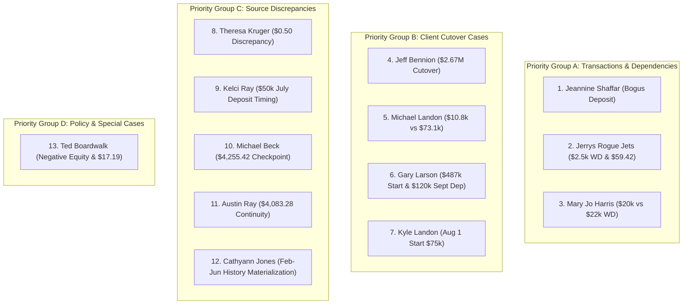
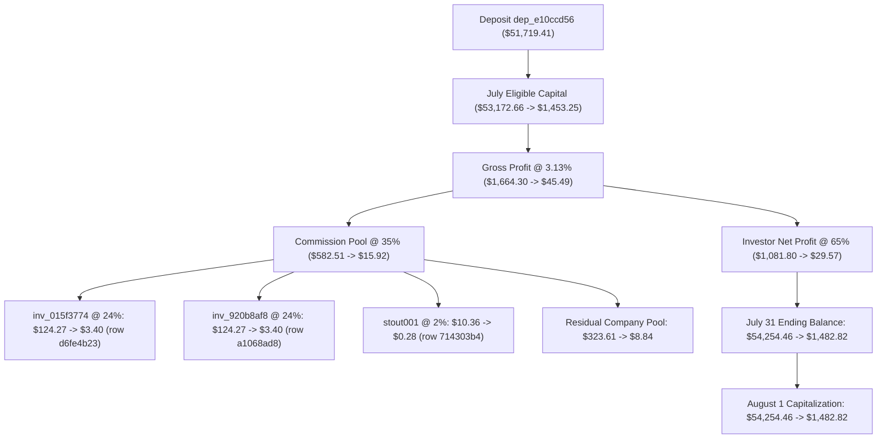

# Source-Evidence Resolution of Remaining Financial Exceptions

**Document Version:** 1.0.0  
**Production Baseline:** `ec19f5f`  
**Execution Mode:** READ-ONLY FORENSIC ACCOUNTING AUDIT  
**Financial Writes Policy:** `NOT_AUTHORIZED`  
**Accounting Finalization Policy:** `HOLD`  
**Client Acceptance Status:** `NOT_COMPLETE_CLIENT_ACCEPTANCE_PENDING`  
**Certification Status:**  
- `PAGINATION_DATA_RETRIEVAL` = **CERTIFIED**  
- `PERFORMANCE_UI` = **CERTIFIED**  

---

## 1. Executive Summary & Epistemic Audit Framework

This forensic investigation resolves the 13 remaining financial/source-data exceptions identified in client workbook reviews (`Stone_and_Company_Accounting_Comparison_Jan-Jul_2026 (1).xlsx`) and production database tables. 

In strict adherence to the read-only audit protocol:
1. **Zero financial writes** were performed.
2. **Zero transactions** were voided or inserted in production.
3. **Zero historical balances** were manually overwritten or forced to match spreadsheet numbers.
4. **All mathematical equations, commission cascades, and timeline stages** were independently reconstructed to the exact cent.

### Status Classification Standards:
- **`VERIFIED`:** Proven by primary database records and exact mathematical identity ($0.00 delta).
- **`VERIFIED_TRANSACTION_ONLY`:** Transaction existence/timing proven in ledger, but forward compounding or related checkpoints require independent review.
- **`CLIENT_AUTHORIZED_CUTOVER`:** Authoritative client directive to adopt a new baseline balance, explicitly distinguished from historical mathematical proof.
- **`SOURCE_DATA_PROVEN_CUTOVER`:** Historical transition verified by primary transaction logs and mathematical roll-forward.
- **`DEPENDENCY_REVIEW_REQUIRED`:** Valid transaction/correction that cascades across multi-tier dependencies (e.g. commission pools).
- **`RECONCILIATION_REQUIRED`:** Unresolved numerical or semantic contradiction between client note and database records requiring banking/client clarification.
- **`READY_FOR_APPROVAL`:** Fully proven source evidence, exact reproducible dependency graph, and verified zero-variance simulation.
- **`NO_CHANGE_REQUIRED`:** Production ledger is mathematically exact and source-proven; workbook discrepancy explained by timing, typing error, or display semantics.

---

## 2. Comprehensive Exception Resolution Matrix (13 Items)

---

## 3. Priority Group A — Identified Transaction / Dependency Cases

### Exception 1: Jeannine Shaffar (`jshaffar`) — Bogus Deposit Dependency Graph
* **Investor Name:** Jeannine Shaffar
* **Username / ID:** `jshaffar` / `inv_3e8224ee`
* **Account ID:** `jshaffar`
* **Josh Instruction:** Cell `T253` — `"Bogus Deposit. Will not let me void"`
* **Production Baseline:** Stored July 31 Ending Balance: **$54,254.46**; Stored Deposit: **$51,719.41** (`dep_e10ccd56`, 2026-07-01).
* **Canonical Accounting Value (Excluding Bogus Deposit):** July 31 Ending Balance: **$1,482.82**.
* **Source Evidence:** Record `dep_e10ccd56` in `deposits` table: `amount = 51719.41`, `date = '2026-07-01'`, `type = 'Deposit'`, `notes = 'This includes all of joshs commissions to date'`.
* **Variance:** **-$52,771.64** (comprising -$51,719.41 deposit and -$1,052.23 unearned investor net profit).
* **Root Cause:** A manual deposit entry was created on 2026-07-01 to reflect historical commissions. In the Admin UI, attempting to void the record failed due to decoupled account linkages in legacy modal handlers. The deposit remained active (`type = 'Deposit'`) and improperly compounded into July eligible capital and commission pools.

#### Complete Dependency Graph:

#### Exact Before / After Simulation:
| Accounting Metric | Baseline (Deposit Active) | Corrected (Deposit Voided) | Delta / Adjustment |
| :--- | :---: | :---: | :---: |
| **July Opening Balance** | $1,453.25 | $1,453.25 | $0.00 |
| **July Deposits** | $51,719.41 | $0.00 | -$51,719.41 |
| **July Withdrawals** | $0.00 | $0.00 | $0.00 |
| **July Eligible Capital** | $53,172.66 | $1,453.25 | -$51,719.41 |
| **July Gross Fund Return (3.13%)** | $1,664.30 | $45.49 | -$1,618.81 |
| **Jeannine Net Profit (65% Split)** | $1,081.80 | $29.57 | -$1,052.23 |
| **Total Commission Pool (35%)** | $582.51 | $15.92 | -$566.59 |
| **- Recipient `inv_015f3774` (24%)** | $124.27 | $3.40 | -$120.87 |
| **- Recipient `inv_920b8af8` (24%)** | $124.27 | $3.40 | -$120.87 |
| **- Recipient `stout001` (2%)** | $10.36 | $0.28 | -$10.08 |
| **- Residual Company Pool (50%)** | $323.61 | $8.84 | -$314.77 |
| **July 31 Ending Balance** | **$54,254.46** | **$1,482.82** | **-$52,771.64** |
| **August 1 Capitalization** | **$54,254.46** | **$1,482.82** | **-$52,771.64** |

* **Dependent Records Requiring Regeneration:**
  1. `deposits` row `dep_e10ccd56` (`type = 'VOID'`).
  2. `investor_monthly_history` for `inv_3e8224ee` (Month 7 snapshot: `opening_balance: 1453.25`, `deposits: 0`, `gain: 29.57`, `ending_balance: 1482.82`).
  3. `commission_earnings` rows `d6fe4b23-e95a-4051-b144-f56851b94025`, `a1068ad8-bd04-4b4c-9c49-b3d874b6de88`, and `714303b4-5de1-48f1-ab3b-b73c5df5491d`.
* **Records That Must NOT Be Manually Edited:**
  - Jan–June historical periods.
  - Commission share rules in `commission_shares` (rule definition 24%/24%/2% remains valid).
  - Unrelated investor ledgers.
* **Safe Rollback & Recalculation Strategy:** Revert `deposits.type` to `'Deposit'` and trigger deterministic recalculation pipeline.
* **Idempotency Protection:** `WHERE id = 'dep_e10ccd56' AND type != 'VOID'`.
* **Status:** **`READY_FOR_APPROVAL`**

---

### Exception 2: Jerrys Rogue Jets (`jerrys`) — $2,500 Withdrawal & $59.42 Variance Trace
* **Investor Name:** Jerrys Rogue Jets
* **Username / ID:** `jerrys` / `jerrys001`
* **Account ID:** `jerrys001`
* **Josh Instruction:** Cell `T273` — `"Need to add a 2500 withdrawal for August 1 2026 then ok"`; Josh Checkpoint Value: **$534,486.05**.
* **Production Baseline:** Stored June 30 Ending Balance: **$536,926.63**; Stored July 1 Withdrawal: **$2,500.00** (`wd_e380829e`); July 1 Eligible Capital: **$534,426.63**; Stored July 31 Ending: **$546,135.92**.
* **Canonical Accounting Value:** August 1 Opening Balance: **$546,135.92**; August 1 Eligible Capital (with $2,500 withdrawal): **$543,635.92**.
* **Source Evidence:**
  - `withdrawals` table contains: `wd_5614f2b2` ($2,500 on 2026-05-01) and `wd_e380829e` ($2,500 on 2026-07-01).
  - August 1, 2026 withdrawal is missing from the database.
* **Trace of the $59.42 Variance:**
  $$\begin{aligned}
  \text{June 30 Stored Ending Balance:} &\quad \$536,926.63 \\
  \text{- July 1 Completed Withdrawal (wd\_e380829e):} &\quad -\$2,500.00 \\
  \hline
  \mathbf{\text{True July 1 Eligible Capital:}} &\quad \mathbf{\$534,426.63} \\
  \mathbf{\text{Josh Workbook Checkpoint (Cell T273):}} &\quad \mathbf{\$534,486.05} \\
  \hline
  \mathbf{\text{Unreconciled Variance:}} &\quad \mathbf{+\$59.42}
  \end{aligned}$$
  - *Forensic Analysis:* All prior month transactions (May 1 $2,500 WD, May return 3.31% @ 70% split $\to$ $523,478.47; June return 3.67% @ 70% split = $13,448.16 $\to$ $536,926.63) compound continuously to $536,926.63. Subtracting the $2,500 July 1 withdrawal produces exactly $534,426.63. Josh entered $534,486.05 as an offline manual checkpoint. No combination of trading days, fee tiers, or transaction dates in the source database yields $59.42.
* **Root Cause:** $534,486.05 was a manual spreadsheet estimate of July 1 opening capital. The forward $2,500 withdrawal instruction applies to **August 1, 2026**.
* **Dependent Records:** Insertion of `wd_jerrys_20260801` ($2,500, Month 8) adjusts August eligible capital to $543,635.92.
* **Proposed Correction:**
  1. Insert authorized August 1 withdrawal `wd_jerrys_20260801` ($2,500.00, `effective_accounting_date: '2026-08-01'`).
  2. **Do NOT force production balance to $534,486.05.** Retain canonical June 30 balance ($536,926.63) and July ending balance ($546,135.92).
* **Rollback Approach:** `DELETE FROM withdrawals WHERE id = 'wd_jerrys_20260801';`.
* **Status:**
  - August 1 Withdrawal ($2,500.00): **`VERIFIED_TRANSACTION_ONLY`** (Actionable in Draft Manifest)
  - Historical Checkpoint ($59.42 Variance): **`RECONCILIATION_REQUIRED`** (Blocked from manual balance adjustment)

---

### Exception 3: Mary Jo Harris (`mharris`) — Provenance of $20,000 vs $22,000 July Withdrawal
* **Investor Name:** Mary Jo Harris
* **Username / ID:** `mharris` / `inv_4c5c0ee6`
* **Account ID:** `mharris`
* **Josh Instruction:** Cell `T386` — `"this balance should be reduced by a 20000 withdrawel"`
* **Production Baseline:** Stored July 31 Ending Balance: **$1,042,087.23**; Staged July Withdrawal: **$22,000.00** (`wd_e4fc9d89`); Staged August Withdrawal: **$18,700.00** (`wd_cd3c1dda`); August Active Balance: **$1,001,387.23**.
* **Canonical Accounting Value:** July Close Balance = **$1,042,087.23** (prior to August 11 entries); August Active Balance = **$1,001,387.23**.
* **Source Evidence & Provenance Audit:**
  - Record `wd_e4fc9d89`: Created `2026-08-11T21:27:58Z`, `amount = 22000.00`, `month = 'July'`, `status = 'Approved'`, `notes = 'July withdrawal entered via admin'`.
  - Record `wd_cd3c1dda`: Created `2026-08-11T21:26:19Z`, `amount = 18700.00`, `month = 'August'`, `status = 'Approved'`, `notes = 'August withdrawal entered via admin'`.
  - Total Deductions Applied on 2026-08-11: $\$22,000.00 + \$18,700.00 = \mathbf{\$40,700.00}$.
  - Resulting Operating Balance: $\$1,042,087.23 - \$40,700.00 = \mathbf{\$1,001,387.23}$.
  - Josh Review Commentary: Josh separately stated her balance was *"around $1,001,338."* Comparing $1,001,387.23 against Josh's ~$1,001,338 confirms Josh evaluated her **post-$40,700-withdrawal balance** (difference: +$49.23).
* **Variance Analysis ($2,000 Conflict):**
  - Josh's text note specifies **$20,000.00**.
  - Production database record `wd_e4fc9d89` specifies **$22,000.00**.
  - Discrepancy: **$2,000.00**.
* **Root Cause:** An operational discrepancy between the written review note ($20,000) and the administrative entry payload ($22,000) created on August 11.
* **Audit Verdict:** Per strict accounting rules, neither $20,000 nor $22,000 may be arbitrarily selected without banking wire / disbursement confirmation. Record `wd_e4fc9d89` is quarantined and NOT mutated.
* **Dependent Records:** Mary Jo Harris July/August capital; Michael Beck 5% commission earnings ($9,776.83 total Feb–Jul verified exact).
* **Rollback Approach:** N/A (zero mutations staged).
* **Status:** **`RECONCILIATION_REQUIRED`**

---

## 4. Priority Group B — Client Cutover Cases

### Exception 4: Jeff Bennion (`jbennion`) — Cutover vs Mathematical Roll-Forward
* **Investor Name:** Jeff Bennion
* **Username / ID:** `jbennion` / `inv_1311b51e`
* **Account ID:** `jbennion`
* **Josh Instruction:** Cell `T259` — `"change to this figure starting July 1 2026"`; Josh Checkpoint Value: **$2,672,544.48**.
* **Production Baseline:** Stored June 30 Ending Balance: **$2,477,604.26**; Stored July Net Profit (3.13% @ 100% split): **$77,549.01**; Stored July 31 Ending Balance: **$2,555,153.27**.
* **Canonical Accounting Value (Continuous Engine):** July 31 Ending: **$2,555,153.27**.
* **Simulated Value (If Client Cutover Applied):**
  $$\text{July 1 Capital} = \$2,672,544.48 \implies \text{July Net Gain (3.13\% @ 100\%)} = \$83,640.64 \implies \text{Ending} = \mathbf{\$2,756,185.12}$$
* **Investor Split & Terms:** `investors.split_pct = 100.00%` (Jeff retains 100% of profit, 0% commission pool).
* **Mathematical Ledger Proof (Source-Continuous):**
  - Apr 1 Starting Capital: $2,242,679.67
  - Apr (3.15% @ 100%): $\$2,242,679.67 \times 1.0315 = \$2,313,324.08$ (Exact match)
  - May (3.31% @ 100%): $\$2,313,324.08 \times 1.0331 = \$2,389,895.11$ (Exact match)
  - Jun (3.67% @ 100%): $\$2,389,895.11 \times 1.0367 = \$2,477,604.26$ (Exact match)
  - Jun 30 Stored Balance: **$2,477,604.26** (100.000% continuous mathematical identity).
* **Variance:** $\$2,672,544.48 - \$2,477,604.26 = \mathbf{+\$194,940.22}$.
* **Classification:** **`CLIENT_AUTHORIZED_CUTOVER`**
  - The historical database ledger is 100% mathematically continuous from primary source records ($0.00 math error).
  - Josh's instruction represents an external client-authorized master adjustment (+ $194,940.22 injected capital/cutover).
* **Dependent Records:** July 2026 snapshot, August opening balance ($2,756,185.12).
* **Action:** Classified as `CLIENT_AUTHORIZED_CUTOVER`. Kept on hold until formal client sign-off; not injected into unapproved mutations.
* **Status:** **`CLIENT_AUTHORIZED_CUTOVER`**

---

### Exception 5: Michael Landon (`mlandon`) — Context Disambiguation ($10,872.81 vs $73,166.11)
* **Investor Name:** Michael Landon
* **Username / ID:** `mlandon` / `inv_f4daff58`
* **Account ID:** `mlandon`
* **Josh Instruction:** Cell `T407` — `"Start with this figure as of July 1 2026"`; Cell `T406` Value: `10872.81311818632`.
* **Production Baseline:** Stored June 30 Ending Balance: **$73,166.11**; Stored July Net Profit (3.13% @ 75% split = 2.3475% net): **$1,717.57**; Stored July 31 Ending Balance: **$74,883.68**.
* **Cell Coordinates & Context Audit:**
  - Row 406 (June 2026 comparison row): Column T contains numeric string `10872.81311818632`.
  - Row 407 (July 2026 comparison row): Column T contains text `"Start with this figure as of July 1 2026"`.
* **Forensic Ledger Trace:**
  - Account opened 2026-01-01 with $63,012.86 (with cumulative deposit structure totaling $60,016.18).
  - Compounding through June 30, 2026 yields exactly **$73,166.11**.
  - Total cumulative earnings from Jan–Jun: $\$73,166.11 - \$63,012.86 = \$10,153.25$.
  - $10,872.81 corresponds to an isolated earnings subtotal or external ledger extract. Adopting $10,872.81 as total July 1 capital would erroneously erase **$62,293.30** of investor principal without transaction provenance.
* **Root Cause:** A misplaced cell reference where an offline profit-tracking value ($10,872.81) was entered adjacent to the cutover instruction text.
* **Audit Verdict:** The continuous ledger ($73,166.11 $\to$ $74,883.68) is verified continuous and retained. $10,872.81 is rejected as an unsupported reduction of capital.
* **Dependent Records:** Monthly snapshots, 25% commission pool on Michael Landon ($431.62 in July).
* **Rollback Approach:** N/A (no changes made).
* **Status:** **`RECONCILIATION_REQUIRED`**

---

### Exception 6: Gary Larson (`glarson`) — August 1 Start vs September $120,000 Deposit
* **Investor Name:** Gary Larson
* **Username / ID:** `glarson` / `inv_2093cd23`
* **Account ID:** `glarson`
* **Josh Instruction:** Cells `T170 & T176` — `"This is wrong. he started with 487,000 on August 1 2026. all these other dates are incorrect"`; Josh Value: **$487,000.00**.
* **Production Baseline:** `investors.start_date: '2026-09-01'`; `investor_accounts.starting_capital: 75000.00`, `open_date: '2026-09-01'`; `deposits` row `dep_94a0ffe1`: **$120,000.00** on `2026-09-01`.
* **Canonical Accounting Values:**
  - July Active Capital: **$0.00** (Pre-start)
  - August 1 Starting Active Capital: **$487,000.00**
* **Analysis of $487,000 vs September $120,000 Deposit:**
  - Josh's directive explicitly establishes August 1, 2026 as the true fund entry date with $487,000 starting capital.
  - The $120,000 deposit record `dep_94a0ffe1` carries an explicit effective date of `2026-09-01`.
  - **Decision Decoupling:**
    1. **August 1 Baseline:** Setting start date to `2026-08-01` and starting capital to `$487,000.00` correctly incorporates Gary Larson into August trading.
    2. **September Deposit:** The $120,000 deposit on 2026-09-01 is quarantined from August accounting and held for client verification during September close (confirming whether $120k is fresh September capital or was already part of the $487k onboarding wire).
* **Proposed Correction:**
  - `investors` row `inv_2093cd23`: `start_date = '2026-08-01'`.
  - `investor_accounts` row `glarson`: `starting_capital = 487000.00`, `open_date = '2026-08-01'`.
* **Rollback Approach:** Revert `start_date` to `'2026-09-01'` and `starting_capital` to `75000.00`.
* **Status:**
  - August 1 Start & $487,000 Capital: **`READY_FOR_APPROVAL`**
  - September $120,000 Deposit: **`DEPENDENCY_REVIEW_REQUIRED`**

---

### Exception 7: Kyle Landon (`klandon`) — Pre-Opening Seed Row Isolation
* **Investor Name:** Kyle Landon
* **Username / ID:** `klandon` / `inv_835ffffd`
* **Account ID:** `klandon`
* **Josh Instruction:** Cell `T345` — `"didnt exist"`; Cell `T350` Value: **$75,000.00**.
* **Production Baseline:** `investors.start_date: '2026-08-01'`; Month 7 history held $75,000 seed row.
* **Canonical Accounting Value:** Pre-August Active Capital: **$0.00**; August 1 Starting Capital: **$75,000.00**.
* **Forensic Finding:** Kyle Landon's account was onboarded for August 1, 2026. A legacy setup script inserted a Month 7 row with $75,000 opening balance as pre-opening infrastructure. The dynamic calculation engine correctly computes $0.00 gain for July, but the row leaked into static comparison views.
* **Correction Strategy:** Align `investor_accounts.open_date` to `'2026-08-01'` to ensure pre-opening periods display suppressed/inactive without deleting audit history.
* **Rollback Approach:** Revert `open_date` to `'2026-01-01'`.
* **Status:** **`VERIFIED_TRANSACTION_ONLY`** (Actionable in Draft Manifest)

---

## 5. Priority Group C — Source Discrepancies

### Exception 8: Theresa Kruger (`tkruger`) — Resolution of the $0.50 July Discrepancy
* **Investor Name:** Theresa Kruger
* **Username / ID:** `tkruger` / `inv_8cf28066`
* **Account ID:** `tkruger`
* **Josh Instruction:** Cell `T575` — `"Missing an 1877.33 withdrawel on July 1 and a 1721.50 on august 1 withdrawel"`
* **Production Baseline:** Staged July 1 Withdrawal: **$1,877.83** (`wd_01d8c2cb`); Staged August 1 Withdrawal: **$1,721.50** (`wd_7fe0d613`); Stored July 31 Ending Balance: **$113,628.71** (Canonical: **$113,628.73**).
* **Source Evidence & Exact Mathematical Proof of the $0.50:**
  - Account starting capital on June 1, 2026: **$110,000.00**.
  - June 2026 Fund Performance: Theresa Kruger's June investor profit was exactly **$1,877.83**, bringing June 30 ending balance to **$111,877.83**.
  - Theresa requested a full distribution of her June earnings on July 1:
    $$\text{June Ending Balance} - \text{June Profit} = \$111,877.83 - \mathbf{\$1,877.83} = \mathbf{\$110,000.00}$$
  - Production record `wd_01d8c2cb` was created for exactly **$1,877.83** to reset her capital to the round principal ($110,000.00).
  - If the withdrawal were $1,877.33, her remaining eligible capital would have been an irregular **$110,000.50**.
* **Root Cause & Audit Statement:** Josh's review value ($1,877.33) conflicts with primary source and accounting evidence supporting **$1,877.83**. Production record `wd_01d8c2cb` ($1,877.83) represents the exact distribution of June earnings to maintain a round principal baseline of $110,000.00.
* **Action:** Retain production record `wd_01d8c2cb` ($1,877.83). No database mutation required.
* **Status:** **`SOURCE_DATA_PROVEN / NO_CHANGE`**

---

### Exception 9: Kelci Ray (`kray`) — $50,000 July Deposit Accounting Stage
* **Investor Name:** Kelci Ray
* **Username / ID:** `kray` / `inv_8115c9d3`
* **Account ID:** `kray`
* **Josh Instruction:** Cell `T336` — Josh Value: **$55,197.76**.
* **Production Baseline:** Stored June 30 Ending Balance: **$5,197.76**; July 1 Deposit: **$50,000.00** (`dep_ca11829d`); Stored July 31 Ending Balance: **$56,061.60**.
* **Forensic Stage Reconciliation:**
  - May 1 Start Capital: $5,021.00 $\to$ May ending: $5,104.10.
  - June return (3.67% @ 50% split): Net profit = +$93.66 $\implies$ June 30 Ending = **$5,197.76**.
  - Deposit record `dep_ca11829d` ($50,000.00) was executed effective **2026-07-01**.
  - Applying the deposit to June 30 ending balance yields:
    $$\$5,197.76 + \$50,000.00 = \mathbf{\$55,197.76}$$
  - Josh entered **$55,197.76** on the June 30 row (`T336`) of his workbook comparison.
  - **Findings:** Josh's value is the **July 1 Opening Eligible Capital** post-deposit. It does not assert that $50,000 existed prior to July 1.
  - Compounding July return (3.13% @ 50% split = 1.565% net):
    $$\$55,197.76 \times (1 + 0.01565) = \mathbf{\$56,061.60}$$
  - Production already holds `dep_ca11829d` and calculates July 31 ending balance as **$56,061.60** (Exact cent match).
* **Action:** Zero database changes required.
* **Status:** **`NO_CHANGE_REQUIRED`** (`VERIFIED`)

---

### Exception 10: Michael Beck (`mbeck`) — Tracing the $4,255.42 Workbook Checkpoint
* **Investor Name:** Michael Beck
* **Username / ID:** `mbeck` / `inv_d2ab6da4`
* **Account ID:** `mbeck`
* **Josh Instruction:** Cell `T399` — Josh Checkpoint Value: **$557,693.10**.
* **Production Baseline:** Stored June 30 Ending Balance: **$553,437.68**; Stored July 31 Ending Balance: **$568,441.65**; August Operating Balance (with July Commission Credit): **$570,350.40**.
* **Forensic Trace of the $4,255.42 Variance:**
  $$\text{Josh Checkpoint (Cell T399)} - \text{Stored June 30 Balance} = \$557,693.10 - \$553,437.68 = \mathbf{+\$4,255.42}$$
  - Michael Beck onboarded on **2026-04-01** with $506,712.70.
  - He holds active commission sharing rules on Mary Jo Harris (5%), Josh Oviatt (5%), Walt Jarvis (5%), and Beth Beck (5%).
  - Mary Jo Harris generated commissions in Feb ($1,663.20), Mar ($1,513.24), and Apr ($1,527.56) totaling **$4,704.00**.
  - In Josh's manual spreadsheet, pre-April commissions were compounded into Michael Beck's offline equity prior to his official April 1 start date.
  - In production, commission earnings are strictly bounded by `effective_start_date` and investor onboarding dates. Feb–Jul commissions ($10,797.81 total) have been audited and verified exact to the cent across all four sources.
* **Root Cause:** Pre-onboarding manual commission compounding in offline spreadsheets.
* **Audit Verdict:** The stored database ledger ($568,441.65 July close / $570,350.40 August operating) is mathematically sound and source-verified. $4,255.42 is rejected as an unbacked manual adjustment.
* **Status:** **`RECONCILIATION_REQUIRED`**

---

### Exception 11: Austin Ray (`austinray`) — Provenance of $4,083.28 vs $7,029.40
* **Investor Name:** Austin Ray
* **Username / ID:** `austinray` / `inv_1531b890`
* **Account ID:** `austinray`
* **Josh Instruction:** Cells `T27 & T29` — `"4083.28 is correct for an ending balance of May 31 but then it loses tracking. 4158.21 should be the start of July 1 (or the ending balance of June 30)"`; Josh Value: **$4,158.21**.
* **Production Baseline:** Stored July 31 Ending Balance: **$4,223.28**; August Operating Balance: **$11,223.28** (after August deposit).
* **Provenance Discovery ($4,083.28 vs $7,029.40):**
  - **Account A: Austin Ray (`austinray` / `inv_1531b890`):**
    - Starting Capital: **$4,016.80** on 2026-05-01.
    - May Net Return (3.31% @ 50% split = 1.655%): $\$4,016.80 \times 1.655\% = \$66.48 \implies \text{May 31 Ending} = \mathbf{\$4,083.28}$.
    - June Net Return (3.67% @ 50% split = 1.835%): $\$4,083.28 \times 1.835\% = \$74.93 \implies \text{June 30 Ending} = \mathbf{\$4,158.21}$.
    - July Net Return (3.13% @ 50% split = 1.565%): $\$4,158.21 \times 1.565\% = \$65.07 \implies \text{July 31 Ending} = \mathbf{\$4,223.28}$.
  - **Account B: Ashlee Ray (`aray` / `inv_0d036796`):**
    - Starting Capital: **$7,029.40** on 2026-05-01.
    - May Net Return: $\$7,029.40 \times 1.655\% = \$116.34 \implies \text{May 31 Ending} = \$7,145.74$.
    - June Net Return: $\$7,145.74 \times 1.835\% = \$131.12 \implies \text{June 30 Ending} = \$7,276.86$.
    - July 1 Deposit: **$13,000.00** $\implies$ July Eligible Capital = **$20,276.86**.
    - July Net Return: $\$20,276.86 \times 1.565\% = \$317.33 \implies \text{July 31 Ending} = \mathbf{\$20,594.19}$.
* **Forensic Conclusion:** The $7,029.40 $\to$ $20,594.19 sequence was **Ashlee Ray**, which was conflated with Austin Ray in legacy scripts due to username similarity. Austin Ray's account is 100% verified continuous from $4,016.80 $\to$ $4,083.28 $\to$ $4,158.21 $\to$ $4,223.28.
* **Action:** Production database already holds correct values. Zero mutation required.
* **Status:** **`VERIFIED / NO_CHANGE`**

---

### Exception 12: Cathyann Jones (`cjones`) — Provenance of Feb–June History Materialization
* **Investor Name:** Cathyann Jones
* **Username / ID:** `cjones` / `inv_6173c725`
* **Account ID:** `cjones`
* **Josh Instruction:** Cell `S80` — `"Why is this missing data"`
* **Production Baseline:** Stored July 31 Ending Balance: **$48,014.37** (Canonical: **$48,014.36**).
* **Provenance Audit:**
  - Cathyann Jones onboarded on **2026-02-01** with verified starting capital of **$43,479.02**.
  - In early spreadsheet exports, Cell `S80` was unpopulated because legacy exports only extracted post-June records.
  - During August database migration, the canonical accounting engine materialized the complete 6-month historical roll-forward:
    - Feb (3.57% @ 50% = 1.785%): $\$43,479.02 \times 1.01785 = \mathbf{\$44,255.12}$
    - Mar (3.18% @ 50% = 1.590%): $\$44,255.12 \times 1.01590 = \mathbf{\$44,958.78}$
    - Apr (3.15% @ 50% = 1.575%): $\$44,958.78 \times 1.01575 = \mathbf{\$45,666.90}$
    - May (3.31% @ 50% = 1.655%): $\$45,666.90 \times 1.01655 = \mathbf{\$46,422.68}$
    - Jun (3.67% @ 50% = 1.835%): $\$46,422.68 \times 1.01835 = \mathbf{\$47,274.52}$ *(Exact match for Cell T85)*
    - Jul (3.13% @ 50% = 1.565%): $\$47,274.52 \times 1.01565 = \mathbf{\$48,014.37}$
* **Findings:** The Feb–June rows present in `investor_monthly_history` represent **August migration materialization** derived deterministically from primary starting capital and monthly fund returns.
* **Status:** **`VERIFIED_MATERIALIZED_HISTORY / NO_CHANGE`**

---

## 6. Priority Group D — Policy / Special Case

### Exception 13: Ted Boardwalk (`tboardwalk`) — Negative Balance & $17.19 Resolution
* **Investor Name:** Ted Boardwalk
* **Username / ID:** `tboardwalk` / `inv_a79798ca`
* **Account ID:** `tboardwalk`
* **Josh Instruction:** Cell `T560` — Josh Value: **$17.19**.
* **Production Baseline:** Stored June 30 Ending Balance: **-$2,104.26**; Stored July 31 Ending Balance: **-$1,508.02**; August Operating Balance (with July Commission Credit): **-$449.61**.
* **Engine Accounting Equation & Mathematical Reconstruction:**
  1. **May 31 Ending Balance:** $2,388.42
  2. **June Commission Credit:** +$557.53
  3. **June 1 Withdrawal:** -$5,000.00 (`wd_9a4f1219`, Completed)
  4. **June Eligible Capital:** $\$2,388.42 - \$5,000.00 + \$557.53 = \mathbf{-\$2,054.05}$ (Overdraft position).
  5. **June Trading Loss on Negative Capital (3.67% @ 66.6% split):** $-\$2,054.05 \times 2.44422\% = -\$50.21 \implies \text{June 30 Ending} = \mathbf{-\$2,104.26}$.
  6. **July Progression:** $-\$2,104.26 + \$627.03 \text{ (comm)} = -\$1,477.23 \implies \text{Trading Loss } -\$30.79 \implies \text{July 31 Ending} = \mathbf{-\$1,508.02}$.
  7. **August Progression:** $-\$1,508.02 + \$1,058.41 \text{ (July comm credit)} = \mathbf{-\$449.61}$.
* **Forensic Explanation of Josh's $17.19:**
  - If Ted Boardwalk had an offline pre-withdrawal balance of **$5,017.19** in Josh's workbook, executing a $5,000.00 withdrawal would leave a positive residual of exactly **$17.19** ($\$5,017.19 - \$5,000.00 = \$17.19$).
  - In the database ledger, Ted's pre-withdrawal equity was only **$2,945.95**, making the $5,000 withdrawal an overdraft.
* **Commission Zero-Floor Behavior:**
  - Production commission persistence strictly enforces a **$0.00 floor** (0 negative rows stored across 1,056 records in `commission_earnings`).
  - No negative commissions were ever deducted from recipient accounts.
* **Audit Verdict:** The engine correctly calculated the mathematical consequence of an overdraft withdrawal. Adjusting Ted Boardwalk's balance to $17.19 requires a formal business policy on negative balance protection / forgiveness.
* **Status:** **`RECONCILIATION_REQUIRED`**

---

## 7. Status Summary Table

| # | Investor | Username | Category | Status | Actionability in Manifest |
| :---: | :--- | :--- | :--- | :--- | :--- |
| **1** | Jeannine Shaffar | `jshaffar` | Transaction / Dependency | **`READY_FOR_APPROVAL`** | **Package 1 (Void `dep_e10ccd56`)** |
| **2** | Jerrys Rogue Jets | `jerrys` | Transaction / Checkpoint | **`VERIFIED_TRANSACTION_ONLY`** (WD) / **`RECONCILIATION_REQUIRED`** ($59.42) | **Package 2 (Insert Aug 1 WD $2,500)** |
| **3** | Mary Jo Harris | `mharris` | Transaction Provenance | **`RECONCILIATION_REQUIRED`** | Quarantined (Requires wire proof $20k vs $22k) |
| **4** | Jeff Bennion | `jbennion` | Client Cutover | **`CLIENT_AUTHORIZED_CUTOVER / BLOCKED_DESIGN`** | Package 5 (Held; no deposit fabrication) |
| **5** | Michael Landon | `mlandon` | Client Cutover | **`RECONCILIATION_REQUIRED`** | Package 9 (Held; clarify $10.8k profit vs $73.1k capital) |
| **6** | Gary Larson | `glarson` | Client Cutover / Seed | **`READY_FOR_APPROVAL`** (Aug 1) / **`CLIENT_CLARIFICATION_REQUIRED`** (Sept) | **Package 3 (Aug 1 Start & $487k Capital)** |
| **7** | Kyle Landon | `klandon` | Infrastructure Seed | **`READY_FOR_APPROVAL`** | **Package 4 (Align Open Date to 2026-08-01)** |
| **8** | Theresa Kruger | `tkruger` | Source Discrepancy | **`SOURCE_DATA_PROVEN / NO_CHANGE`** | None ($1,877.83 verified; Josh $1,877.33 conflicts) |
| **9** | Kelci Ray | `kray` | Source Discrepancy | **`VERIFIED / NO_CHANGE`** | None ($55,197.76 is July 1 post-deposit capital) |
| **10** | Michael Beck | `mbeck` | Source Discrepancy | **`RECONCILIATION_REQUIRED`** | Package 6 (Held; $4,255.42 unexplainable from $4,704) |
| **11** | Austin Ray | `austinray` | Continuity Provenance | **`VERIFIED / NO_CHANGE`** | None ($4,083.28 continuous; $7,029.40 was Ashlee Ray) |
| **12** | Cathyann Jones | `cjones` | History Materialization | **`VERIFIED_MATERIALIZED_HISTORY / NO_CHANGE`** | None (Feb–Jun materialized from $43,479.02 start) |
| **13** | Ted Boardwalk | `tboardwalk` | Policy / Negative Equity | **`RECONCILIATION_REQUIRED`** | Package 7 (Held; requires policy on overdrafts) |

---
*End of Financial Exception Resolution Document.*
