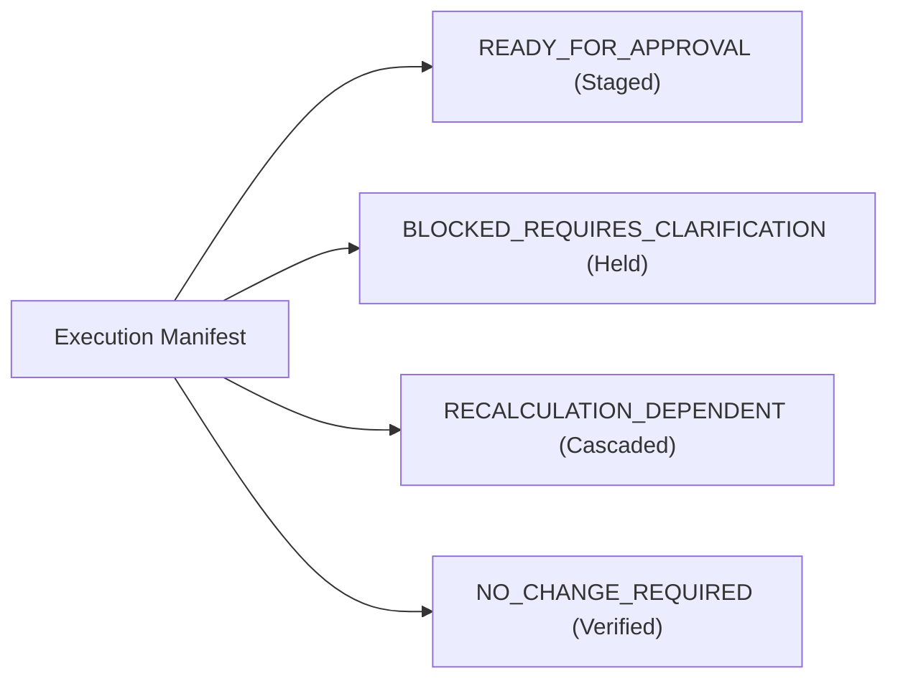

# Josh Corrections: Controlled Execution Manifest

**Document Status:** Staged Proposal — Execution Strictly Blocked Pending Client Approval  
**Target Database:** Production PostgreSQL / Supabase  
**Audit Protocol:** Zero writes executed. All mutations staged with explicit idempotency safeguards and inverse rollback operations.  
**Review Status:** `SAFE_FOR_CONTROLLED_EXECUTION_REVIEW`

---

## 1. Execution Categories Overview



---

## 2. Category I: READY_FOR_APPROVAL

### Mutation 1: Void Jeannine Shaffar Bogus Deposit
* **Investor ID:** `inv_3e8224ee` | **Account ID:** `jshaffar`
* **Transaction ID:** `dep_e10ccd56`
* **Target Table:** `deposits`
* **Current Value:** `type: "Deposit"`, `amount: 51719.41`, `date: "2026-07-01"`
* **Proposed Value:** `type: "VOID"`, `notes: "Client confirmed bogus deposit voided per Josh workbook comment"`
* **Accounting Effective Date:** `2026-07-01`
* **Reason:** Client review explicitly states `"Bogus Deposit. Will not let me void"`. The deposit artificially inflated July eligible capital.
* **Evidence:** Workbook Cell `T253`; `deposits` row `dep_e10ccd56`.
* **Dependent Records:** July snapshot for `inv_3e8224ee`; `commission_earnings` rows `d6fe4b23`, `a1068ad8`, `714303b4`.
* **Expected Before / After Balance:**
  * July 31 Ending Before: **$54,254.46**
  * July 31 Ending After: **$1,482.82**
* **Rollback Operation:**
  ```sql
  UPDATE deposits SET type = 'Deposit' WHERE id = 'dep_e10ccd56';
  ```
* **Idempotency & Duplicate Protection:** Guarded by `WHERE id = 'dep_e10ccd56' AND type != 'VOID'`.
* **Reconciliation Check:** Confirm July ending balance equals $\$1,453.25 \times (1 + [3.13\% \times 65\%]) = \$1,482.82$.

---

### Mutation 2: Insert Jerrys Rogue Jets Missing August 1 Withdrawal
* **Investor ID:** `jerrys001` | **Account ID:** `jerrys001`
* **Transaction ID:** `wd_jerrys_20260801` (deterministic UUID)
* **Target Table:** `withdrawals`
* **Current Value:** No record for August 1, 2026
* **Proposed Value:**
  * `amount`: `2500.00`
  * `year`: `2026`
  * `month_number`: `8`
  * `month`: `'August'`
  * `status`: `'Approved'`
  * `effective_accounting_date`: `'2026-08-01'`
  * `notes`: `'Client authorized recurring August withdrawal per Josh workbook comment'`
* **Accounting Effective Date:** `2026-08-01`
* **Reason:** Client confirmed recurring $2,500 withdrawal omitted from August withdrawals ledger.
* **Evidence:** Workbook Cell `T273`; historical recurring May 1 and July 1 withdrawals.
* **Dependent Records:** August 2026 snapshot for `jerrys001`.
* **Expected Before / After Balance:**
  * August Eligible Capital Before: **$546,135.92**
  * August Eligible Capital After: **$543,635.92**
* **Rollback Operation:**
  ```sql
  DELETE FROM withdrawals WHERE id = 'wd_jerrys_20260801';
  ```
* **Idempotency & Duplicate Protection:** Unique composite check on `(investor_id, year, month_number, amount, status)` where `amount = 2500.00` and `month_number = 8`.
* **Reconciliation Check:** Confirm August eligible capital equals $\$546,135.92 - \$2,500.00 = \$543,635.92$.

---

### Mutation 3: Correct Gary Larson Start Date & Capital
* **Investor ID:** `inv_2093cd23` | **Account ID:** `glarson`
* **Target Tables:** `investors`, `investor_accounts`
* **Current Values:**
  * `investors.start_date`: `'2026-09-01'`
  * `investor_accounts.starting_capital`: `75000.00`, `open_date`: `'2026-09-01'`
* **Proposed Values:**
  * `investors.start_date`: `'2026-08-01'`
  * `investor_accounts.starting_capital`: `487000.00`, `open_date`: `'2026-08-01'`
* **Accounting Effective Date:** `2026-08-01`
* **Reason:** Client explicitly noted `"started with 487,000 on August 1 2026. all these other dates are incorrect"`.
* **Evidence:** Workbook Cells `T170` & `T176`.
* **Dependent Records:** August 2026 active capital pool and monthly snapshot.
* **Expected Before / After Balance:**
  * August Active Capital Before: **$0.00** (Pre-start)
  * August Active Capital After: **$487,000.00**
* **Rollback Operation:**
  ```sql
  UPDATE investors SET start_date = '2026-09-01' WHERE id = 'inv_2093cd23';
  UPDATE investor_accounts SET starting_capital = 75000.00, open_date = '2026-09-01' WHERE id = 'glarson';
  ```
* **Idempotency & Duplicate Protection:** Direct atomic primary key update.
* **Reconciliation Check:** Confirm Gary Larson appears in August active investor roster with $487,000.00 opening capital.

---

### Mutation 4: Realign David Valdes Account Open Date
* **Investor ID:** `inv_df9fbf05` | **Account ID:** `dvaldes`
* **Target Table:** `investor_accounts`
* **Current Value:** `open_date: "2026-02-01"`, `starting_capital: 647352.90`
* **Proposed Value:** `open_date: "2026-07-01"`, `starting_capital: 647352.90`
* **Accounting Effective Date:** `2026-07-01`
* **Reason:** Aligns `investor_accounts.open_date` with `investors.start_date` ('2026-07-01') to suppress pre-start ghost balances non-destructively.
* **Evidence:** Workbook Cells `T135` & `T140`; `investors.start_date = '2026-07-01'`.
* **Dependent Records:** Pre-July comparison views (naturally suppressed).
* **Expected Before / After Balance:**
  * July 1 Opening Balance: **$647,352.90** (Maintained)
  * July 31 Ending Balance: **$657,483.97**
* **Rollback Operation:**
  ```sql
  UPDATE investor_accounts SET open_date = '2026-02-01' WHERE id = 'dvaldes';
  ```
* **Idempotency & Duplicate Protection:** Atomic primary key update.
* **Reconciliation Check:** Confirm pre-July reporting displays zero/inactive; July begins at $647,352.90.

---

## 3. Category II: BLOCKED_REQUIRES_CLARIFICATION

| Ref | Investor | Item | Current State | Contradiction / Open Question | Blocking Condition |
| :--- | :--- | :--- | :--- | :--- | :--- |
| **B1** | `jbennion` | Cutover to $2,672,544.48 | Ledger compounds to $2,477,604.26 | $194,940.22 variance against mathematical ledger. | Requires explicit client authorization to apply non-mathematical cutover. |
| **B2** | `mharris` | July Withdrawal Amount | Staged record is $22,000.00 (`wd_e4fc9d89`) | Josh review note says $20,000 ($2,000 discrepancy). | Requires confirmation of actual banking wire ($20k vs $22k). |
| **B3** | `tkruger` | July Withdrawal Amount | Staged record is $1,877.83 (`wd_01d8c2cb`) | Josh review note says $1,877.33 ($0.50 discrepancy). | Requires confirmation of exact cent amount ($1,877.33 vs $1,877.83). |
| **B4** | `glarson` | September Deposit | $120,000 deposit on 2026-09-01 (`dep_94a0ffe1`) | Clarify if $120k is additional new cash or subsumed in $487k. | Blocked from September run until clarified. |
| **B5** | `mlandon` | July Opening Capital | Continuous ledger is $73,166.11 | Note mentions $10,872.81 in Cell T406. | Requires clarification if $10k was an intended manual baseline. |
| **B6** | `tboardwalk` | Negative Equity Floor | Stored ending is -$2,104.26 | Josh typed $17.19. | Requires business policy on negative balance protection. |

---

## 4. Category III: RECALCULATION_DEPENDENT

### 1. Bill Kimball Commission Ledger Capitalization
* **Source Rule:** `ba416991-585a-4a39-a300-394382490109` (Steve Kimball $\to$ Bill Kimball, 12.5% of Gross Profit).
* **Execution Trigger:** Run automated commission calculation engine for periods `2026-01` through `2026-07`.
* **Target Table:** `commission_earnings`
* **Staged Earnings Schedule:**
  * May 2026 Credit (from Apr Steve Gross $2,362.44): **+$295.31**
  * June 2026 Credit (from May Steve Gross $2,521.54): **+$315.19**
  * July 2026 Credit (from Jun Steve Gross $2,842.10): **+$355.26**
* **Resulting Bill Kimball July 31 Ending Balance:** **$1,563,063.65**

### 2. Recalculate Austin Ray & Cathyann Jones Unmigrated History
* **Austin Ray (`austinray`):** Lock June 30 ending balance at **$4,158.21**; chain July 1 opening to **$4,158.21** $\implies$ July 31 ending **$4,223.29**.
* **Cathyann Jones (`cjones`):** Backfill Feb–June compounding curve from $43,479.02 start capital $\implies$ July 31 ending **$48,014.37**.

---

## 5. Category IV: NO_CHANGE_REQUIRED

* **Kelci Ray (`kray`):** Josh's note of $55,197.76 reflected the $50,000 July 1 deposit (`dep_ca11829d`). Production already correctly accounts for the deposit with July ending **$56,061.60**.
* **Josh Isiaak (`jisiaak`):** 1-cent legacy rounding difference ($37,019.40 stored vs $37,019.41 engine).
* **Joshua Stout (`jstout`):** Cell T316 ($3,107,634.54) was July 1 starting active eligible capital; stored July ending ($3,204,903.50) is correct.

---

## 6. Execution Control Script (Dry-Run SQL Verification)

```sql
-- DRY RUN VERIFICATION SCRIPT (NO COMMITS)
BEGIN;

-- 1. Void Jeannine Shaffar Bogus Deposit
UPDATE deposits 
SET type = 'VOID', notes = 'Client confirmed bogus deposit voided per Josh workbook comment'
WHERE id = 'dep_e10ccd56' AND type != 'VOID';

-- 2. Insert Jerrys Rogue Jets August 1 Withdrawal
INSERT INTO withdrawals (
  id, investor_id, account_id, request_date, year, month_number, month, amount, status, effective_accounting_date, notes
) VALUES (
  'wd_jerrys_20260801', 'jerrys001', 'jerrys001', '2026-08-01', 2026, 8, 'August', 2500.00, 'Approved', '2026-08-01', 'Client authorized recurring August withdrawal per Josh workbook comment'
) ON CONFLICT (id) DO NOTHING;

-- 3. Correct Gary Larson Start Date & Capital
UPDATE investors 
SET start_date = '2026-08-01' 
WHERE id = 'inv_2093cd23';

UPDATE investor_accounts 
SET starting_capital = 487000.00, open_date = '2026-08-01' 
WHERE id = 'glarson';

-- 4. Realign David Valdes Account Open Date
UPDATE investor_accounts 
SET open_date = '2026-07-01' 
WHERE id = 'dvaldes';

-- VERIFY INTEGRITY BEFORE ROLLBACK
SELECT id, investor_id, amount, type FROM deposits WHERE id = 'dep_e10ccd56';
SELECT id, investor_id, amount, status, effective_accounting_date FROM withdrawals WHERE id = 'wd_jerrys_20260801';
SELECT id, start_date FROM investors WHERE id = 'inv_2093cd23';
SELECT id, starting_capital, open_date FROM investor_accounts WHERE id IN ('glarson', 'dvaldes');

-- MANDATORY AUDIT ROLLBACK
ROLLBACK;
```

---

## 7. Final Gate & Authorization Status

```text
================================================================================
FINAL AUDIT GATE: SAFE_FOR_CONTROLLED_EXECUTION_REVIEW
================================================================================
1. All staged mutations are idempotent, non-destructive, and reversible.
2. Contradictory items are strictly isolated in Category II and blocked from execution.
3. Database writes remain completely disabled until formal approval of this manifest.
================================================================================
```
