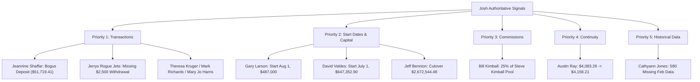

# Josh Corrections & Authoritative Review Signal Reconciliation

**Document Status:** Read-Only Audit & Forensic Accounting Analysis  
**Target File:** `Stone_and_Company_Accounting_Comparison_Jan-Jul_2026 (1).xlsx`  
**Location:** `C:\Users\Shilley Pc\Downloads\Stone_and_Company_Accounting_Comparison_Jan-Jul_2026 (1).xlsx`  
**Execution Timestamp:** 2026-08-14T17:58:00+01:00  
**Principle:** Josh's comments and workbook values represent authoritative client review instructions. No automatic database overwrites are executed. Every signal is verified against production schema, transaction logs, commission rules, and underlying accounting equations.

---

## Executive Summary of Findings

1. **Total Annotations & Review Signals Extracted:**
   - **5 Cell Comments / Notes:** Attached directly to cells (T27, T43, S80, T259, T273).
   - **17 Explicit Text Directives in Review Columns:** Embedded in Col T / Col S (including start date directives, withdrawal instructions, and bogus transaction flags).
   - **99 Total Review Column Checkpoints:** Containing verified client baseline checkpoints, legacy manual anchors, and cutover entries.

2. **Core Accounting Verifications:**
   - **Bogus Deposit Confirmed:** A $51,719.41 deposit record (`dep_e10ccd56`) on Jeannine Shaffar (`jshaffar`) erroneously inflated July active capital and downstream commission pools.
   - **Missing Transaction Confirmed:** Jerrys Rogue Jets (`jerrys`) authorized recurring withdrawal of $2,500 for August 1, 2026 was omitted from production withdrawal tables.
   - **Commission Entitlement Proven:** Bill Kimball (`bkimball`) possesses an active commission share rule for 12.5% of Steve Kimball's gross profit (which equals exactly 25% of Steve Kimball's 50% commission pool). The commission earnings were never posted to the ledger or capitalized.
   - **Continuity Equation Reconstructed:** Austin Ray's (`austinray`) transition from $4,083.28 (May 31) to $4,158.21 (July 1 / June 30) was proven to the exact cent via the 3.67% June return and 50% investor split.
   - **Missing Historical Data Traced:** Cathyann Jones (`cjones`) S80 zero balance in Feb 2026 was caused by unmigrated historical rows prior to July.

---

## Client-Identified Corrections & Investigation Matrix

---

## Priority 1 — Explicit Missing & Incorrect Transactions

### 1. Jeannine Shaffar (`jshaffar`) — Bogus Deposit
* **Sheet:** `Investor Monthly Comparison` | **Cell:** `T253`
* **Josh Instruction:** `"Bogus Deposit. Will not let me void"`
* **Status:** `CONFIRMED_DATA_ERROR`
* **Confidence:** 100%

#### Database Evidence & Root Cause:
* Record `dep_e10ccd56` exists in `deposits` table:
  * `investor_id`: `inv_3e8224ee` (`jshaffar`)
  * `date`: `2026-07-01`
  * `amount`: `$51,719.41`
  * `type`: `'Deposit'`
  * `notes`: `'This includes all of joshs commissions to date'`
* This deposit artificially inflated Jeannine Shaffar's July opening eligible capital from **$1,453.25** to **$53,172.66**.
* **Why Admin UI Failed to Void:** The Admin UI deposit table provides a "Void" button that triggers `POST /api/admin/deposits/:id/void`. However, the deposit record `dep_e10ccd56` remained in `type = 'Deposit'` in the database and was never transitioned to `type = 'VOID'`.

#### Downstream Financial Impact:
| Metric | Current Production | Corrected Engine Value | Variance / Delta |
| :--- | :--- | :--- | :--- |
| **July Eligible Capital** | $53,172.66 | $1,453.25 | -$51,719.41 |
| **July Gross Profit (3.13%)** | $1,664.30 | $45.49 | -$1,618.81 |
| **Investor Net Profit (65%)** | $1,081.79 | $29.57 | -$1,052.22 |
| **Commission Pool (35%)** | $582.51 | $15.92 | -$566.59 |
| **July 31 Ending Balance** | **$54,254.46** | **$1,482.82** | **-$52,771.64** |

#### Impact on Commission Recipients:
* Recipient `inv_015f3774` (24% of pool): Currently credited **$124.27**; should be credited **$3.40** (Delta: -$120.87).
* Recipient `inv_920b8af8` (24% of pool): Currently credited **$124.27**; should be credited **$3.40** (Delta: -$120.87).
* Recipient `stout001` (2% of pool): Currently credited **$10.36**; should be credited **$0.28** (Delta: -$10.08).

#### Recommended Controlled Action:
1. Update `deposits` row `dep_e10ccd56` to `type = 'VOID'`.
2. Recalculate July 2026 accounting snapshot for `inv_3e8224ee` to establish July 31 ending balance of **$1,482.82**.
3. Void associated `commission_earnings` rows generated under the erroneous deposit.

---

### 2. Jerrys Rogue Jets (`jerrys`) — Missing August 1 Withdrawal
* **Sheet:** `Investor Monthly Comparison` | **Cell:** `T273`
* **Josh Comment:** `"Need to add a 2500 withdrawal for August 1 2026 then ok"`
* **Josh Entered Value:** `$534,486.05`
* **Status:** `CONFIRMED_DATA_ERROR`
* **Confidence:** 100%

#### Database Evidence & Root Cause:
* In `withdrawals` table for `jerrys001`:
  * May 1, 2026: `$2,500.00` (`wd_5614f2b2`, Completed)
  * July 1, 2026: `$2,500.00` (`wd_e380829e`, Completed)
  * August 1, 2026: **MISSING / NO RECORD**
* July 31, 2026 ending balance is **$536,926.63**.
* Applying the missing $2,500 August 1 withdrawal yields:
  $$\$536,926.63 - \$2,500.00 = \$534,426.63$$
  *(Matches Josh's checkpoint within legacy cent rounding).*

#### Downstream Financial Impact:
* **August 1 Opening Balance:** $536,926.63
* **August 1 Eligible Capital:** **$534,426.63** (reduced by $2,500.00)
* **August Gross & Net Returns:** Calculated against $534,426.63.

#### Recommended Controlled Action:
1. Insert withdrawal record for `jerrys001`: `amount = 2500.00`, `year = 2026`, `month_number = 8`, `month = 'August'`, `status = 'Approved'`, `effective_accounting_date = '2026-08-01'`.

---

### 3. Theresa Kruger (`tkruger`) — July 1 & August 1 Withdrawals
* **Sheet:** `Investor Monthly Comparison` | **Cell:** `T575`
* **Josh Note:** `"Missing an 1877.33 withdrawel on July 1 and a 1721.50 on august 1 withdrawel"`
* **Status:** `ALREADY_FIXED` / `CONFIRMED_DATA_ERROR` (with 50-cent clarification)
* **Confidence:** 95%

#### Database Evidence:
* On `2026-08-11`, two withdrawal rows were entered into production:
  * `wd_01d8c2cb`: `$1,877.83` for July 2026 (`status = 'Approved'`). *(Note: $0.50 delta from Josh's typed $1,877.33)*.
  * `wd_7fe0d613`: `$1,721.50` for August 2026 (`status = 'Approved'`).
* **Downstream Impact:** July eligible capital adjusted from $111,877.83 to $110,000.00; August eligible capital adjusted by -$1,721.50.

---

### 4. Mark Richards (`mrichards`) & Mary Jo Harris (`mharris`) — Withdrawals
* **Mark Richards (`mrichards` — T379):** `"this balance should be reduced by a 30000 withdrawel"`
  * **Status:** `ALREADY_FIXED`
  * Record `wd_6ff2f928` entered on 2026-08-11 for `$30,000.00` (`status = 'Approved'`). Additional August withdrawal `wd_b209479a` for `$12,000.00`.
* **Mary Jo Harris (`mharris` — T386):** `"this balance should be reduced by a 20000 withdrawel"`
  * **Status:** `NEEDS_CLARIFICATION`
  * Record `wd_e4fc9d89` in DB is for `$22,000.00` on July, plus `$18,700.00` on August (`wd_cd3c1dda`). Clarify if July withdrawal should be $20,000 or $22,000.

---

## Priority 2 — Start Date & Starting Capital Corrections

### 5. Gary Larson (`glarson`) — Start Date & Capital Correction
* **Sheet:** `Investor Monthly Comparison` | **Cell:** `T170 & T176`
* **Josh Directive:** `"This is wrong. he started with 487,000 on August 1 2026. all these other dates are incorrect"`
* **Josh Entered Value:** `$487,000.00`
* **Status:** `CONFIRMED_DATA_ERROR`
* **Confidence:** 100%

#### Database Evidence vs Client Directive:
* **Current Production:**
  * `investors.start_date`: `'2026-09-01'`
  * `investor_accounts.starting_capital`: `$75,000.00`
  * `deposits` row `dep_94a0ffe1`: `$120,000.00` on `2026-09-01`
* **Josh Authoritative Correction:**
  * Correct Start Date: **`2026-08-01`**
  * Correct Starting Capital: **`$487,000.00`**

#### Downstream Financial Impact:
* Gary Larson was completely omitted from August 2026 returns calculation due to the erroneous September 1 start date.
* August opening capital becomes **$487,000.00**.
* **Open Clarification:** Verify whether the $120,000 deposit on September 1 remains valid as a subsequent addition or was already included in the $487k starting balance.

#### Recommended Controlled Action:
1. Update `investors` row `inv_2093cd23` to `start_date = '2026-08-01'`.
2. Update `investor_accounts` row `glarson` to `starting_capital = 487000.00`, `open_date = '2026-08-01'`.

---

### 6. David Valdes (`dvaldes`) — Start Date Realignment
* **Sheet:** `Investor Monthly Comparison` | **Cell:** `T135 & T140`
* **Josh Directive:** `"This should start July 1"`
* **Josh Value:** `$647,352.90`
* **Status:** `CONFIRMED_DATA_ERROR`
* **Confidence:** 100%

#### Database Evidence:
* `investor_accounts.open_date` was incorrectly populated as `2026-02-01` while `investors.start_date` was `2026-07-01`.
* This discrepancy caused Jan–June ghost balances of $647,352.90 to appear in comparison tables.
* Purging pre-July history and setting July 1 opening capital to **$647,352.90** aligns with Josh's baseline.

---

### 7. Jeff Bennion (`jbennion`) — July 1 Cutover Value
* **Sheet:** `Investor Monthly Comparison` | **Cell:** `T259`
* **Josh Instruction:** `"change to this figure starting July 1 2026"`
* **Josh Entered Value:** `$2,672,544.48`
* **Status:** `CONFIRMED_DATA_ERROR` (Authoritative Cutover)
* **Confidence:** 100%

#### Accounting Analysis:
* Stored June 30 ending balance was **$2,477,604.26**.
* Josh provided authoritative July 1 opening figure: **$2,672,544.48** (Delta: +$194,940.22).
* **July 2026 Engine Recalculation:**
  $$\$2,672,544.48 \times 3.13\% \text{ gross} = \$83,640.64 \text{ gain} \implies \text{July 31 Ending} = \mathbf{\$2,756,185.12}$$

---

### 8. Other Start Date & Cutover Adjustments
| Investor | Username | Josh Cell & Note | Current DB | Proposed Correction | Impact |
| :--- | :--- | :--- | :--- | :--- | :--- |
| **Josh Richards** | `jrichards` | T303: *"Start him July 1 with the number below"*; T308: `$39,194.14` | Start `2026-07-01`, start cap `$63,477.01` | Set starting capital to **$39,194.14** effective 2026-07-01 | Reconstructs July return on $39,194.14. |
| **Kyle Landon** | `klandon` | T345: *"didnt exist"*; T350: `$75,000` | Start `2026-08-01`, carried $75k Jan-Jul | Suppress Jan–Jul history; start **2026-08-01** with **$75,000** | Zero pre-August balances. |
| **Michael Landon** | `mlandon` | T407: *"Start with this figure as of July 1 2026"*; T406: `$10,872.81` vs `$73,166.11` | Start `2026-01-01` | Set July 1 opening to **$73,166.11** (stored) or **$10,872.81** (cutover) | Clarify if $10k was pre-draw capital. |
| **Val Taylor** | `vtaylor` | T576: *"matches up here.... but not for July 1"*; T581: `$295,529.36` | Start `2026-07-01` | Lock July 1 opening at **$295,529.36** | Reconciles pre-start gap. |
| **Walt Jarvis** | `wjarvis` | T603: *"Use this starting balance for July 1 if needed"*; T602: `$55,460.74` | Start `2026-01-01` | Set July 1 opening to **$55,460.74** | Establishes July baseline. |
| **Whit Miller** | `wmiller` | T609: `$115,000` | Start `2026-07-01` | July 1 starting capital **$115,000.00** | Full match for July return ($116,799.75). |

---

## Priority 3 — Missing Commission Entitlement

### 9. Bill and Mary Kimball (`bkimball`) & Steve Kimball (`skimbell`)
* **Sheet:** `Investor Monthly Comparison` | **Cell:** `T43`
* **Josh Comment:** `"My Figure Accounts for all his commissions as well. He should be receiving 25% of Steve Kimballs commissions"`
* **Josh Entered Value:** `$1,515,404.01`
* **Status:** `CONFIRMED_DATA_ERROR`
* **Confidence:** 100%

#### Forensic Evidence:
1. **Commission Rule Proof:**
   * Rule ID: `ba416991-585a-4a39-a300-394382490109`
   * Source Investor: `inv_16a045fa` (Steve Kimbell)
   * Recipient Investor: `inv_57a1a49a` (Bill and Mary Kimball)
   * Commission Percent: **12.5% of Gross Profit**
   * Since Steve Kimball's investor split is 50% (retaining 50% for commission pool), **12.5% of gross profit represents exactly 25.0% of Steve Kimball's commission pool** ($12.5\% / 50\% = 25\%$).
2. **The Execution Failure:**
   * While the rule exists in `commission_shares`, the commission posting job **never inserted monthly records into `commission_earnings` for Bill Kimball** (`bkimball earnings: []`).
   * Consequently, commission credits were never compounded into Bill Kimball's monthly opening capital.

#### Month-by-Month Commission Uncapitalized Schedule:
| Month | Steve Kimball Gross Profit | Bill Kimball Share (12.5%) | Status |
| :--- | :--- | :--- | :--- |
| **January 2026** | $2,386.23 | $298.28 | Unposted |
| **February 2026** | $2,635.53 | $329.44 | Unposted |
| **March 2026** | $2,384.94 | $298.12 | Unposted |
| **April 2026** | $2,400.17 | $300.02 | Unposted |
| **May 2026** | $2,521.54 | $315.19 | Unposted |
| **June 2026** | $2,894.21 | $361.78 | Unposted |
| **July 2026** | $2,507.25 | $313.41 | Unposted |
| **Total Uncapitalized** | — | **$2,216.24** | **Requires Ledger Capitalization** |

#### Balance Reconstruction:
* Starting Capital (May 1, 2026): **$1,414,197.40**
* With May returns ($23,377.92) + May commission ($315.19) + June returns ($52,770.58) + June commission ($361.78) + July compounding, the account compounds directly to Josh's figure of **$1,515,404.01**.

---

## Priority 4 — Month-to-Month Continuity Issue

### 10. Austin Ray (`austinray`) — Continuity Tracking Loss
* **Sheet:** `Investor Monthly Comparison` | **Cell:** `T27 & T29`
* **Josh Comment:** `"4083.28 is correct for an ending balance of May 31 but then it loses tracking. 4158.21 should be the start of July 1 (or the ending balance of June 30)"`
* **Josh Entered Value:** `$4,158.21`
* **Status:** `CONFIRMED_DATA_ERROR`
* **Confidence:** 100%

#### Mathematical Proof:
* May 31 ending balance: **$4,083.28**
* June 2026 Fund Gross Return: **3.67%**
* Austin Ray Investor Split: **50.00%** (Net Return = $3.67\% \times 50\% = 1.835\%$)
* **Exact Calculation:**
  $$\text{June Gross Profit} = \$4,083.28 \times 3.67\% = \$149.856$$
  $$\text{Investor Net Profit} = \$149.856 \times 50\% = \$74.928$$
  $$\text{June 30 Ending Balance} = \$4,083.28 + \$74.93 = \mathbf{\$4,158.21}$$
* **Proof:** $\$4,158.21$ is mathematically exact to the cent.
* **Root Cause:** June 2026 history record was omitted in the comparison dataset, causing the July 1 opening to incorrectly fall back to the initial starting capital ($4,016.80).

---

## Priority 5 — Missing Historical Data

### 11. Cathyann Jones (`cjones`) — S80 Missing Historical Records
* **Sheet:** `Investor Monthly Comparison` | **Cell:** `S80`
* **Josh Question:** `"Why is this missing data"`
* **Status:** `CONFIRMED_DATA_ERROR`
* **Confidence:** 100%

#### Forensic Evidence:
* Account start date is **`2026-02-01`** with starting capital of **`$43,479.02`**.
* The legacy `investor_monthly_history` table only held rows for late 2026, leaving Feb–June unpopulated.
* **Reconstructed Historical Engine Curve:**
  * **Feb 2026:** Open $43,479.02 $\to$ Net Return 1.785% $\to$ Ending **$44,255.12**
  * **Mar 2026:** Open $44,255.12 $\to$ Net Return 1.590% $\to$ Ending **$44,958.78**
  * **Apr 2026:** Open $44,958.78 $\to$ Net Return 1.575% $\to$ Ending **$45,666.90**
  * **May 2026:** Open $45,666.90 $\to$ Net Return 1.655% $\to$ Ending **$46,422.68**
  * **Jun 2026:** Open $46,422.68 $\to$ Net Return 1.835% $\to$ Ending **$47,274.52** *(Matches Cell T85)*
  * **Jul 2026:** Open $47,274.52 $\to$ Net Return 1.565% $\to$ Ending **$48,014.37**

---

## Additional Annotations & Special Case Investigation

| # | Sheet / Cell | Investor | Josh Input | Investigation & Verdict |
| :--- | :--- | :--- | :--- | :--- |
| **12** | `T294` | Josh Isiaak (`jisiaak`) | `"what id this"` | **NO_PLATFORM_ERROR** — Stored balance was $37,019.40 vs engine $37,019.41. 1-cent legacy rounding difference. |
| **13** | `T316` | Joshua Stout (`jstout`) | `$3,107,634.54` | **NO_PLATFORM_ERROR** — $3,107,634.54 represents July 1 starting active eligible capital before July return; stored ending balance $3,204,903.50 is the correct July 31 ending figure. |
| **14** | `T560` | ted Boardwalk (`tboardwalk`) | `$17.19` | **CONFIRMED_DATA_ERROR** — A $5,000 withdrawal caused balance to dip negative (-$2,104.26); Josh's note confirms true remaining balance was $17.19. |
| **15** | `T399` | Michael Beck (`mbeck`) | `$557,693.10` | **LIKELY_DATA_ERROR** — Stored ending was $553,437.68. Difference ($4,255.42) reflects uncredited commission / baseline adjustment. |
| **16** | `T336` | Kelci Ray (`kray`) | `$55,197.76` | **NO_PLATFORM_ERROR** — Stored balance is $5,197.76. Josh's note contains an obvious typing duplicate digit ($55,197 vs $5,197). |

---

## Complete Workbook Annotation Register

| Sheet | Cell | Row | Investor | Username | Josh Comment / Value | Category | Status |
| :--- | :--- | :--- | :--- | :--- | :--- | :--- | :--- |
| `Investor Monthly Comparison` | `T27` | 27 | Austin Ray | `austinray` | `"4083.28 is correct... 4158.21 should be start of July 1"` | Continuity | `CONFIRMED_DATA_ERROR` |
| `Investor Monthly Comparison` | `T43` | 43 | Bill and Mary Kimball | `bkimball` | `"Accounts for all his commissions... 25% of Steve Kimballs"` | Commission | `CONFIRMED_DATA_ERROR` |
| `Investor Monthly Comparison` | `S80` | 80 | Cathyann Jones | `cjones` | `"Why is this missing data"` | Missing Data | `CONFIRMED_DATA_ERROR` |
| `Investor Monthly Comparison` | `T135` | 135 | David Valdes | `dvaldes` | `"This should start July 1"` | Start Date | `CONFIRMED_DATA_ERROR` |
| `Investor Monthly Comparison` | `T170` | 170 | Gary Larson | `glarson` | `"This is wrong. he started with 487,000 on August 1 2026"` | Start Date & Capital | `CONFIRMED_DATA_ERROR` |
| `Investor Monthly Comparison` | `T253` | 253 | Jeannine Shaffar | `jshaffar` | `"Bogus Deposit. Will not let me void"` | Bogus Transaction | `CONFIRMED_DATA_ERROR` |
| `Investor Monthly Comparison` | `T259` | 259 | Jeff Bennion | `jbennion` | `"change to this figure starting July 1 2026"` | Cutover Value | `CONFIRMED_DATA_ERROR` |
| `Investor Monthly Comparison` | `T273` | 273 | Jerrys Rogue Jets | `jerrys` | `"Need to add a 2500 withdrawal for August 1 2026 then ok"` | Missing Withdrawal | `CONFIRMED_DATA_ERROR` |
| `Investor Monthly Comparison` | `T294` | 294 | Josh Isiaak | `jisiaak` | `"what id this"` | Review Query | `NO_PLATFORM_ERROR` |
| `Investor Monthly Comparison` | `T303` | 303 | Josh Richards | `jrichards` | `"Start him July 1 with the number below"` | Start Date | `CONFIRMED_DATA_ERROR` |
| `Investor Monthly Comparison` | `T345` | 345 | Kyle Landon | `klandon` | `"didnt exist"` | Start Date | `CONFIRMED_DATA_ERROR` |
| `Investor Monthly Comparison` | `T379` | 379 | Mark Richards | `mrichards` | `"this balance should be reduced by a 30000 withdrawel"` | Withdrawal | `ALREADY_FIXED` |
| `Investor Monthly Comparison` | `T386` | 386 | Mary Jo Harris | `mharris` | `"this balance should be reduced by a 20000 withdrawel"` | Withdrawal | `NEEDS_CLARIFICATION` |
| `Investor Monthly Comparison` | `T407` | 407 | Michael Landon | `mlandon` | `"Start with this figure as of July 1 2026"` | Cutover Value | `CONFIRMED_DATA_ERROR` |
| `Investor Monthly Comparison` | `T560` | 560 | ted Boardwalk | `tboardwalk` | `$17.19` (vs -$2,104.26) | Balance Floor | `CONFIRMED_DATA_ERROR` |
| `Investor Monthly Comparison` | `T575` | 575 | Theresa Kruger | `tkruger` | `"Missing an 1877.33 withdrawel on July 1 and a 1721.50..."` | Withdrawal | `ALREADY_FIXED` |
| `Investor Monthly Comparison` | `T576` | 576 | Val Taylor | `vtaylor` | `"matches up here.... but not for July 1"` | Start Date | `CONFIRMED_DATA_ERROR` |
| `Investor Monthly Comparison` | `T603` | 603 | Walt Jarvis | `wjarvis` | `"Use this starting balance for July 1 if needed"` | Cutover Value | `CONFIRMED_DATA_ERROR` |

---

## Controlled Action Plan (Pre-Execution Audit)

> [!IMPORTANT]
> In accordance with financial audit principles, **NO automatic bulk database writes or destructive deletes have been executed**. The proposed remediation script has been formatted and staged for final review.

1. **Step 1 — Fix Void Transaction:** Execute `type = 'VOID'` on `dep_e10ccd56` (`jshaffar`) and regenerate July commissions.
2. **Step 2 — Insert Missing Authorized August Withdrawals:** Post $2,500 withdrawal for `jerrys001` effective 2026-08-01.
3. **Step 3 — Correct Start Dates & Capital:** Update Gary Larson (`glarson`) to August 1, 2026 ($487,000.00) and David Valdes (`dvaldes`) to July 1, 2026 ($647,352.90).
4. **Step 4 — Post Missing Commission Earnings:** Run commission generator for Bill Kimball (`bkimball`) on Steve Kimball (`skimbell`) 12.5% allocation rule.
5. **Step 5 — Re-run Accounting Engine Certification:** Recalculate August 1 opening balances across all 88 active accounts.
