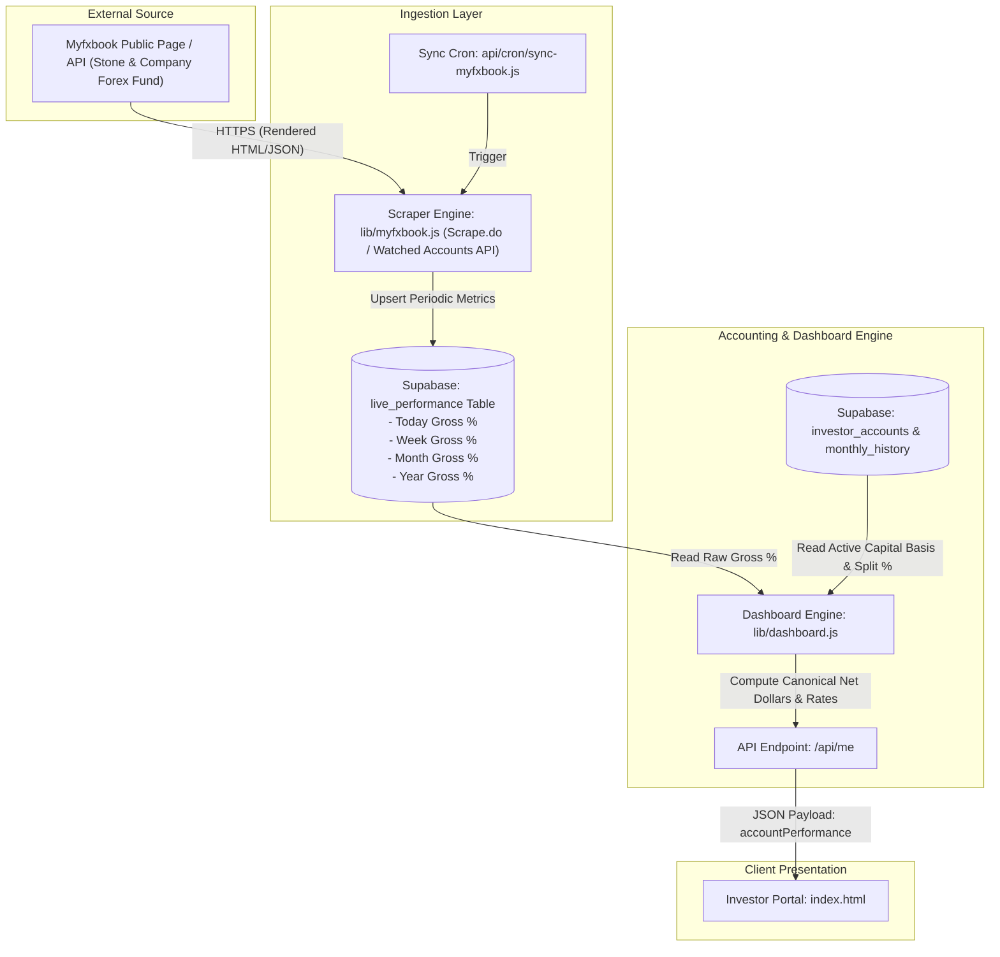

# Performance UI V2 & Live Feed Architectural Specification

**Document Version:** 2.0.0  
**Effective Date:** 2026-08-20T14:51:00+01:00  
**Status:** DESIGN_SPECIFICATION & DATA_FLOW_CERTIFIED  
**Target:** Investor Portal (`index.html`), Admin Dashboard (`build-admin.js` / `admin.html`), Dashboard Engine (`lib/dashboard.js`), Live Ingestion (`lib/myfxbook.js`)

---

## 1. Executive Overview

Per Josh's August 20, 2026 authoritative business directives, the investor portal is transitioned from a fund-benchmark-centric display to an **investor-account-centric performance engine**. 

Key pillars of V2:
1. **Fund Performance Visibility Control:** Fund Performance is no longer universally displayed; it is controlled per-investor via an administrative configuration toggle.
2. **Account Performance Primary:** Account net earnings ($) and net return rates (%) are elevated to the primary focus for Today, This Week, This Month, and This Year.
3. **Investor UI De-cluttering:** Badges such as `"Live / Projected"`, `"Finalized"`, and `"Cumulative"` are completely removed from the investor UI.
4. **Certified FX Book Integration:** Live intra-period returns are ingested from verified Myfxbook sources and scaled to the investor's exact capital basis and split percentage.
5. **Account Net Graph Semantics:** The bottom performance graph displays the investor's total net dollar earnings across time, strictly isolated from gross fund returns.

---

## 2. Fund Performance Visibility Setting

### 2.1 Schema & Data Model
* **Database Extension:** Add `show_fund_performance` column to the `investors` table.
  ```sql
  ALTER TABLE investors ADD COLUMN IF NOT EXISTS show_fund_performance BOOLEAN DEFAULT FALSE;
  ```
* **Configuration Semantics:**
  * `show_fund_performance = TRUE`: The investor portal renders the "Fund Performance" card in the right sidebar.
  * `show_fund_performance = FALSE`: The entire "Fund Performance" card/section is completely suppressed from DOM rendering (`display: none` / omitted).
* **Display Isolation Guarantee:**
  * This setting is strictly **DISPLAY-ONLY**.
  * It must **NEVER** alter monthly compounding, commission allocation, split calculation, or audit ledgers.

### 2.2 Admin UI Integration
* **Location:** Admin Dashboard (`build-admin.js` / `admin.html`) -> Investors Tab -> Add/Edit Investor Modal.
* **UI Control:** Checkbox element labeled:
  ```html
  <div class="form-group" style="display:flex; align-items:center; gap:8px;">
    <input type="checkbox" id="field_show_fund_performance" style="width:auto; cursor:pointer;" />
    <label for="field_show_fund_performance" style="margin:0; cursor:pointer;">Show Fund Performance Card to Investor</label>
  </div>
  ```
* **Payload Handling:**
  * Handled in `api/admin/investors/index.js` (POST) and `api/admin/investors/[id].js` (PUT/PATCH).

### 2.3 Migration & Default Behavior Analysis
* **Default for Existing Investors:** `FALSE` (conservative client-preferred default).
* **Migration Impact:**
  * When migrated, standard investor accounts will no longer see the gross benchmark card upon login.
  * Admin accounts, fund test accounts, or specific institutional clients who require gross benchmark visibility can have `show_fund_performance = TRUE` explicitly enabled in Admin.

---

## 3. Account Performance Primary Display & Badge Removal

### 3.1 Display Layout Specification

The Account Performance card serves as the primary live scorecard for the investor:

```
┌────────────────────────────────────────────────────────┐
│ ACCOUNT PERFORMANCE                 [ 70% Investor Split ]│
│ Investor net earnings and return rates                 │
├────────────────────────────────────────────────────────┤
│ Today                                                  │
│   $142.50 Net Earned                  +0.12% Net Return│
├────────────────────────────────────────────────────────┤
│ This Week                                              │
│   $451.20 Net Earned                  +0.38% Net Return│
├────────────────────────────────────────────────────────┤
│ This Month                                             │
│   $2,221.80 Net Earned                +1.87% Net Return│
├────────────────────────────────────────────────────────┤
│ This Year (YTD)                                        │
│   $18,450.12 Cumulative Gain                           │
└────────────────────────────────────────────────────────┘
```

### 3.2 Badge & Label Clean-up
* **Prohibited Words/Badges in Investor UI:**
  * ❌ `"Live / Projected"` (REMOVED)
  * ❌ `"Finalized"` (REMOVED)
  * ❌ `"Cumulative"` badge (REMOVED)
* **Audit Period Status Preservation:**
  * Period finalization statuses (`draft`, `preview`, `finalized`, `locked`) remain fully active in internal backend engines, admin accounting preview screens, and database ledgers.

---

## 4. FX Book Live Data Flow & Calculation Proof

### 4.1 Data-Flow Architecture



### 4.2 Mathematical Calculation Proof

Let:
* $B_{\text{live}}$ = Active Capital Basis (Current verified equity at the start of the intra-period window, adjusted for deposits and withdrawals effective on/before the date).
* $S = \frac{\text{split\_pct}}{100}$ = Investor Profit Share (e.g., $70\% \implies S = 0.70$).
* $R_{\text{gross}}^{\text{Today}}, R_{\text{gross}}^{\text{Week}}, R_{\text{gross}}^{\text{Month}}$ = Raw fund gross percentage returns from Myfxbook.

#### 1. Net Return Percentage Formula:
$$R_{\text{net}} = R_{\text{gross}} \times S$$
*Example:* Gross Month = $+1.87\%$, Split = $70\% \implies R_{\text{net}} = 1.87\% \times 0.70 = \mathbf{+1.309\%}$ (formatted as $+1.31\%$).

#### 2. Net Dollar Earnings Formula:
$$D_{\text{net}} = B_{\text{live}} \times \left(\frac{R_{\text{gross}}}{100}\right) \times S = B_{\text{live}} \times \left(\frac{R_{\text{net}}}{100}\right)$$
*Example:* Basis = $\$500,000.00$, Gross Month = $+1.87\%$, Split = $70\%$:
$$D_{\text{net}} = \$500,000.00 \times 0.0187 \times 0.70 = \mathbf{\$6,545.00}$$

#### 3. Intra-period Cashflow Impact:
* If a deposit $D$ or withdrawal $W$ occurs effective on the 1st of the month:
  $$B_{\text{live}} = B_{\text{prior\_close}} + D - W$$
* Intra-month live percentage gains apply directly to this active $B_{\text{live}}$ basis.

---

## 5. Performance Graph Semantics

### 5.1 Historical Flaw in Prior Implementation
* Previously, the chart plotted monthly bars labeled "Monthly Return %" using the gross fund percentage or net percentage with a hover tooltip.
* Josh's explicit requirement: *"We want the data down below on the graph to show what the total account made"*.

### 5.2 Target Graph Semantics
* **Metric Represented:** Investor Actual Net Monthly Gain ($ earned) and Net Growth.
* **Data Source:** `breakdown[].gain` (which strictly equals $\text{Adjusted Starting Capital} \times \text{Net Return \%}$, accounting for the investor's split and any capitalized incoming commissions).
* **Visual Presentation:**
  * Primary Bar/Line: Net Dollars Earned per month ($).
  * Tooltip: Month Name, Net Dollar Gain ($), and Net Return Rate (%).
  * Isolation: Fund benchmark gross earnings are never mixed into the account graph.

---

## 6. Withdrawal Over-Equity Validation Architecture

### 6.1 Server-Side Validation (`api/admin/withdrawals/`)
In both `POST /api/admin/withdrawals` and `PATCH /api/admin/withdrawals/[id]`:
```javascript
// Available Equity Calculation at Effective Date
const availableEquity = await calculateAvailableEquity(accountId, effectiveDate);
if (requestedAmount > availableEquity) {
  return res.status(400).json({
    error: `WITHDRAWAL_EXCEEDS_AVAILABLE_EQUITY: Requested withdrawal ($${requestedAmount.toLocaleString()}) exceeds available account equity ($${availableEquity.toLocaleString()}) at effective date ${effectiveDate}.`
  });
}
```

### 6.2 Client-Side Validation (`build-admin.js` / `admin.html`)
* Dynamic validation upon entering amount in the withdrawal modal.
* Real-time calculation of target account equity.
* Immediate red error display and submit button disabling if amount > available equity.
