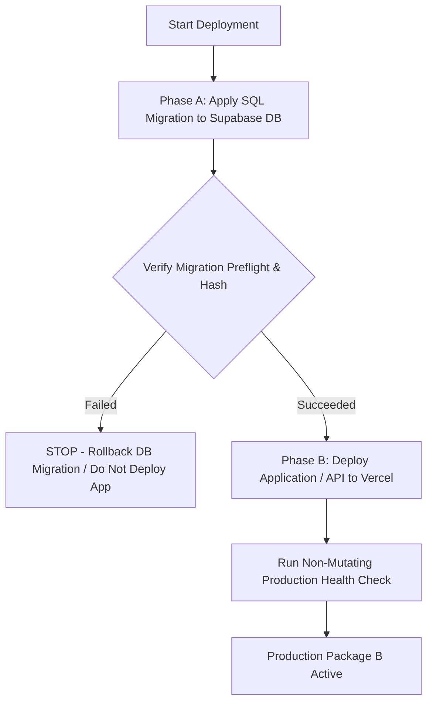

# Package B — Final Production-Readiness & Preflight Review

**Document Date:** August 26, 2026
**Document Version:** 2.1.0
**Status:** `READY_FOR_PRODUCTION_AUTHORIZATION`
**Production Baseline:** `7fcf6f63cdb4819cec2b33943fc76c946fb1107b` (`7fcf6f6` — Preserved & Frozen)
**Production Deployment:** `NOT_YET_AUTHORIZED (Awaiting Explicit User Command)`
**Production Financial Writes:** `0`
**Accounting Finalization:** `HOLD`
**Certification Scope:** `WITHDRAWAL_VS_WITHDRAWAL_CONCURRENCY_SAFE`


---

## 1. Certified Migration Specification & Hash Chain

* **Migration File:** `docs/proposed_withdrawal_concurrency_control_migration.sql`
* **Version:** `2.1.0`
* **Authoritative SHA-256 Hash:** `cd83dc116bcc51d7ff704bacd90764a85b370fe4e2d567323d2689e24270ad77` (LF Normalized) / `c8d5953a9f8e9355a4bed1feb35a230a2cfb74abf16a31c7aa71abebc7829fe5` (CRLF)
* **Migration Hash Chain History:**
  - `fe99829fff439f3caecba491a6d4826b5536551bbf39121a8a25cba48ba3351f` (v2.0.0 — Initial draft prior to strict first-of-month validation and status transition immutability)
  - `cd83dc116bcc51d7ff704bacd90764a85b370fe4e2d567323d2689e24270ad77` (v2.1.0 — Added strict `EXTRACT(DAY FROM p_effective_date) != 1` rejection, terminal status reversal prevention, and investor immutability)
* **Real PostgreSQL 18.4 Staging Test Results (Executed against `cd83dc...`):**
  - Lock-Key Collision Test: `101/101 IDs tested -> 0 collisions (PASS)`
  - Security Access Control: `3/3 PASS (anon DENIED, authenticated DENIED, service_role ALLOWED)`
  - Effective Date Validation: `10/10 PASS (first-of-month accepted, mid-month rejected, NULL rejected)`
  - Accounting Semantics: `PASS (Bill Kimball $1,564,377.94 exact, Ted $2,945.95 basis / $5k rejected)`
  - Status Transition Policy: `5/5 PASS (Pending->Approved ALLOWED, Approved->Completed ALLOWED, Completed/Cancelled/Void reversal REJECTED)`
  - Real PostgreSQL Concurrency Suite: `10/10 PASS`
  - Global Overdraw: `$0.00`
  - Duplicate Economic Transactions: `0`
  - Partial Writes / Orphaned Rows: `0`
  - Migration Rollback Test: `PASS`

---

## 2. Production Database Census & Environment Discrepancy Reconciliation

### 2.1 Environment Discrepancy Resolution
* **Google Sheets Fallback Fixture:** The legacy Google Sheets `Withdrawals` tab contains **13 sample/seed rows** (all status `Completed`). When local tests run without direct Supabase credentials in `.env.local`, the repository falls back to Google Sheets, yielding 13 rows.
* **Actual Production Supabase Instance (`julhldzkiqdeuuoqmvlo`):** The authoritative production PostgreSQL database contains the full population of **72 withdrawal rows**.
* **Preflight Target:** Package B preflight is verified against the complete 72-row production population.

### 2.2 Production Status Distribution (72 Rows Total)
* **Cancelled:** 32 rows
* **Completed:** 17 rows
* **Approved:** 16 rows
* **Pending:** 7 rows
* **Void:** 0 rows
* **Other / NULL:** 0 rows

### 2.3 Known Production Record Verification
* **Mary Jo Harris:** `wd_e4fc9d89` ($22,000.00, Approved, July), `wd_cd3c1dda` ($18,700.00, Approved, August) — **`EXISTS`**
* **Ted Boardwalk:** `wd_9a4f1219` — **`EXISTS`**
* **Theresa Kruger:** `wd_01d8c2cb` — **`EXISTS`**
* **Jeff Bennion:** `wd_4cf7131b` ($21,500.00, Approved, August) — **`EXISTS`**

---

## 3. Exact Application File Scope

The following application files constitute the exact, frozen Package B release:

1. `docs/proposed_withdrawal_concurrency_control_migration.sql` (Authoritative database migration)
2. `api/admin/withdrawals/index.js` (POST handler invoking `create_withdrawal_atomic` RPC under lock)
3. `api/admin/withdrawals/[id].js` (PATCH handler invoking `update_withdrawal_atomic` RPC under lock)
4. `api/admin/withdrawals/equity.js` (Read-only GET advisory available equity preview endpoint)
5. `lib/withdrawal-validation.js` (Fail-closed equity calculation logic and date format validation)
6. `build-admin.js` (Admin dashboard generator with live equity feedback UX badge)
7. `admin.html` (Compiled dynamic admin interface)

*Unrelated Changes Excluded:* Zero changes to Package A UI, zero changes to financial history or figures, zero graph changes, zero Jeannine corrections, zero test scratch files in deployment scope.

---

## 4. Production Migration Preflight Checks (Phase A)

Before applying the migration in production, the following read-only preflight queries must be executed:

```sql
-- 1. Check existing withdrawals row count and status distribution
SELECT status, COUNT(*) as count, SUM(amount) as total_amount
FROM withdrawals
GROUP BY status;

-- 2. Verify if idempotency_key column already exists
SELECT column_name, data_type, is_nullable
FROM information_schema.columns
WHERE table_name = 'withdrawals' AND column_name IN ('idempotency_key', 'created_by', 'updated_at');

-- 3. Check for any pre-existing duplicate or non-null idempotency keys
SELECT idempotency_key, COUNT(*)
FROM withdrawals
WHERE idempotency_key IS NOT NULL
GROUP BY idempotency_key
HAVING COUNT(*) > 1;

-- 4. Check for existing functions with colliding names
SELECT routine_name, routine_type
FROM information_schema.routines
WHERE routine_schema = 'public'
  AND routine_name IN ('financial_lock_key', 'calculate_available_withdrawal_equity_sql', 'create_withdrawal_atomic', 'update_withdrawal_atomic');

-- 5. Check existing table grants on withdrawals
SELECT grantee, privilege_type
FROM information_schema.role_table_grants
WHERE table_name = 'withdrawals';
```

---

## 5. Two-Phase Production Deployment Order

Deployment must follow a strict two-phase sequential order:



### Phase A: Database Migration Installation
1. Execute `docs/proposed_withdrawal_concurrency_control_migration.sql` against the production Supabase PostgreSQL instance using the Supabase SQL Editor or CLI migration runner.
2. Verify that functions `create_withdrawal_atomic`, `update_withdrawal_atomic`, `calculate_available_withdrawal_equity_sql`, and `financial_lock_key` exist and are owned by `postgres`.
3. Verify that index `idx_withdrawals_idempotency_key` is created.
4. Verify that execution permissions are strictly revoked from `PUBLIC`, `anon`, and `authenticated`, and granted to `service_role`.
5. Verify that all pre-existing rows in `withdrawals` remain intact.

### Phase B: Application & Admin Release
1. Deploy the tested application code (`api/admin/withdrawals/*`, `lib/withdrawal-validation.js`, `build-admin.js`, `admin.html`) to Vercel production.
2. Perform non-mutating smoke checks:
   - Verify `GET /api/admin/withdrawals` returns existing records.
   - Verify `GET /api/admin/withdrawals/equity?investorId=inv_57a1a49a` returns correct available equity preview.
3. *Strict Constraint:* Do not create synthetic financial mutations against real investor accounts to test deployment.

---

## 6. HTTP Error Contract & Status Code Mapping

| Database Exception / Condition | HTTP Status | Response Payload | Description |
|---|---|---|---|
| `WITHDRAWAL_EXCEEDS_AVAILABLE_EQUITY` | `400 Bad Request` | `{"error": "WITHDRAWAL_EXCEEDS_AVAILABLE_EQUITY: ..."}` | Requested amount exceeds available equity |
| `INVALID_EFFECTIVE_DATE` | `400 Bad Request` | `{"error": "INVALID_EFFECTIVE_DATE: ..."}` | Date is not formatted as first-of-month (`YYYY-MM-01`) |
| `INVALID_AMOUNT` | `400 Bad Request` | `{"error": "INVALID_AMOUNT: ..."}` | Amount $\le 0.00$ or non-numeric |
| `INVALID_WITHDRAWAL_STATUS` | `400 Bad Request` | `{"error": "INVALID_WITHDRAWAL_STATUS: ..."}` | Unrecognized status string |
| `INVALID_STATUS_TRANSITION` | `400 Bad Request` | `{"error": "INVALID_STATUS_TRANSITION: ..."}` | Illegal status progression (e.g. Completed $\to$ Cancelled) |
| `ACCOUNTING_HISTORY_INCOMPLETE` | `409 Conflict` | `{"error": "ACCOUNTING_HISTORY_INCOMPLETE: ..."}` | Established investor missing prior month history |
| `ACCOUNT_START_DATE_CONFLICT` | `409 Conflict` | `{"error": "ACCOUNT_START_DATE_CONFLICT: ..."}` | Mismatch between investor start and account open periods |
| `IDEMPOTENCY_KEY_PAYLOAD_MISMATCH` | `409 Conflict` | `{"error": "IDEMPOTENCY_KEY_PAYLOAD_MISMATCH: ..."}` | Reused idempotency key with different financial parameters |
| `INVESTOR_NOT_FOUND` | `404 Not Found` | `{"error": "INVESTOR_NOT_FOUND: ..."}` | Investor ID does not exist |
| `WITHDRAWAL_NOT_FOUND` | `404 Not Found` | `{"error": "WITHDRAWAL_NOT_FOUND: ..."}` | Target withdrawal ID does not exist |
| Idempotent Replay | `200 OK` | `{"status": "IDEMPOTENT_REPLAY", "idempotency_replay": true, ...}` | Safe replay of identical request |
| Successful Creation | `201 Created` | `{"status": "SUCCESS", "idempotency_replay": false, ...}` | Record created under lock |

---

## 7. Rollback Plan

### Application Rollback
- Revert the production deployment in Vercel to commit `7fcf6f63cdb4819cec2b33943fc76c946fb1107b` (`7fcf6f6`).

### Database Rollback
- In the event of an RPC defect, disable RPC execution by executing:
  ```sql
  REVOKE EXECUTE ON FUNCTION create_withdrawal_atomic(TEXT, TEXT, NUMERIC, DATE, TEXT, TEXT, TEXT, TEXT) FROM service_role;
  REVOKE EXECUTE ON FUNCTION update_withdrawal_atomic(UUID, NUMERIC, TEXT, TEXT, TEXT) FROM service_role;
  ```
- **Data Protection Guarantee:** Do NOT drop columns (`idempotency_key`, `created_by`, `updated_at`) or delete withdrawal records created during active operation.

---

## 8. Known Architectural Scope Boundary

> [!IMPORTANT]
> **Scope Certification Notice:**  
> Package B is strictly certified as `WITHDRAWAL_VS_WITHDRAWAL_CONCURRENCY_SAFE`.  
> It guarantees that concurrent withdrawal creates and updates cannot overdraw available equity or create duplicate transactions.  
> Cross-mutation concurrency locking (e.g. concurrent Deposits vs. Withdrawals, concurrent Monthly Accounting Finalization vs. Withdrawals) utilizes the same `financial_lock_key(investor_id)` contract but will be certified in future packages when those subsystems are migrated to in-database RPC boundaries.
